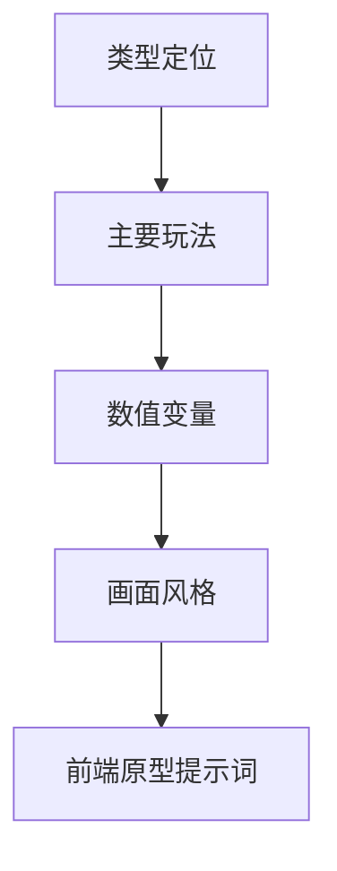
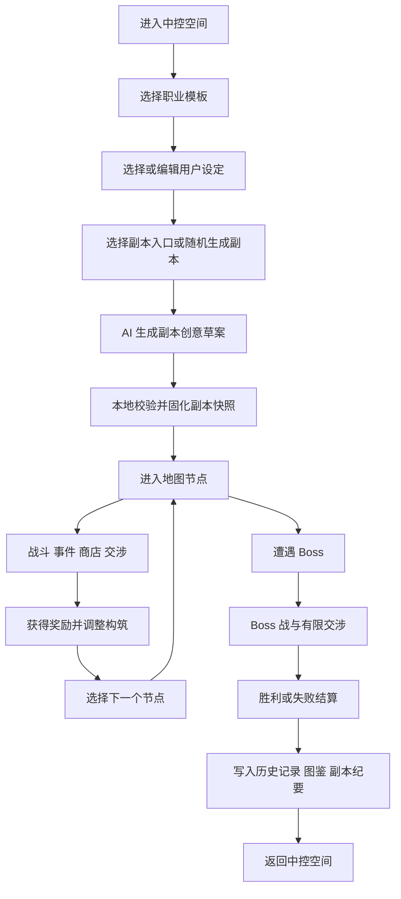
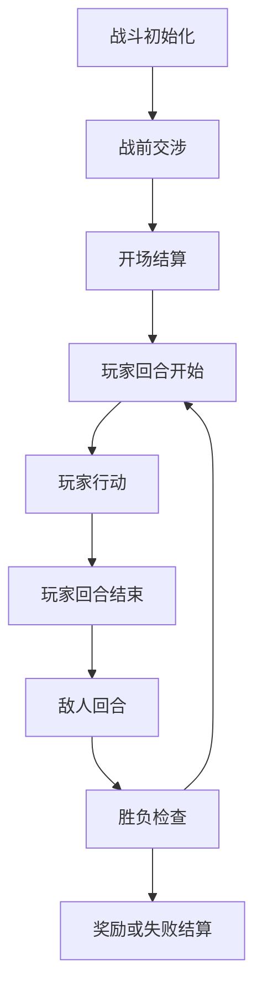
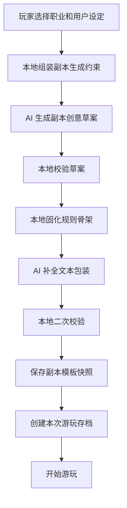
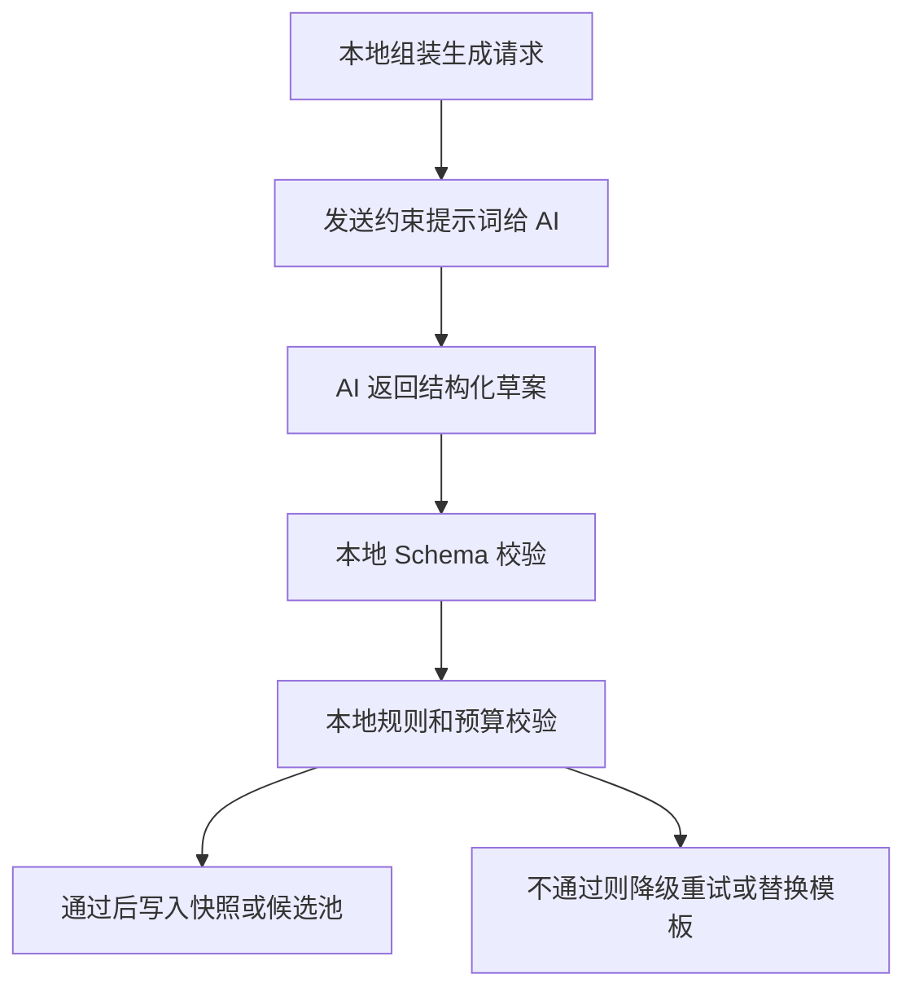
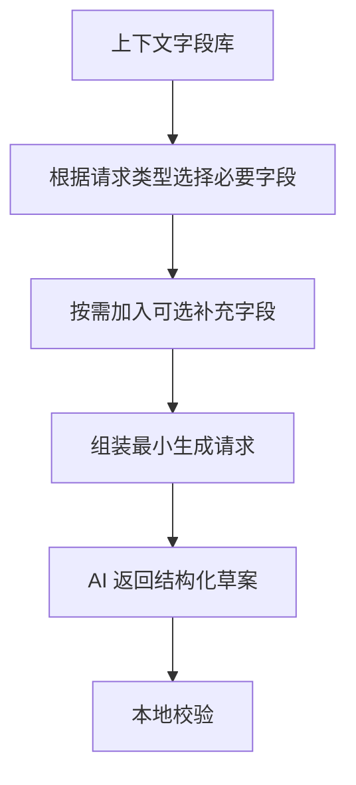
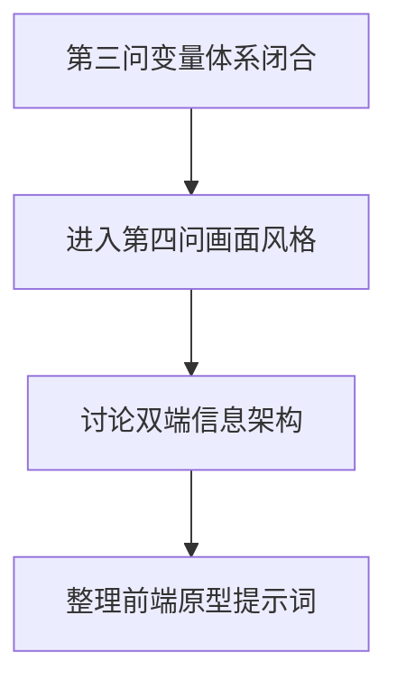

# AI 游戏卡最终设计蓝图

> 本文档用于记录游戏完整蓝图。后续讨论优先围绕“这个游戏最终应该是什么样”展开，而不是把设计拆成不同版本。
>
> 开发实现时可以分步骤落地，但设计讨论本身先按完整游戏蓝图来做。

## 1. 当前共识

项目方向：独立 Web 形态的无限流 AIRP / CCG roguelike 游戏。

核心体验：

- 玩家是真实使用者，不等同于游戏内代理投射。
- 玩家在中控空间选择职业 / 构筑模板。
- 职业 / 构筑模板拥有初始牌组、职业机制、卡池倾向和默认叙事外壳。
- 玩家用职业模板与用户设定生成本次代理投射，进入随机副本世界。
- 每个副本世界都是异常世界切片，拥有自己的 NPC、阵营、剧情、敌人、事件、Boss 和胜利目标。
- 主要玩法是 CCG 回合制卡牌战斗。
- AI 负责叙事、NPC 反应、事件文本、交涉结果建议和世界包装。
- 本地规则系统负责数值、战斗、奖励、路线、存档和合法性校验。

## 2. 设计讨论方式

后续不再把不同版本作为两套设计来讨论；当前主文档只记录完整蓝图。

当前按教程中的游戏设计方法推进，先回答四个问题：

1. 类型：这张游戏卡 / 独立 Web 游戏到底是什么类型。
2. 主要玩法：玩家主要在做什么，想体现什么独特乐趣。
3. 数值变量：基于玩法，需要追踪哪些规则、资源、状态和成长字段。
4. 画面风格：基于类型、玩法和变量，再讨论游戏看起来应该是什么样。

也就是说，UI 不是用来反推玩法的，而是服务玩法。前端原型提示词可以等玩法蓝图清楚后再写。

### 2.1 当前设计顺序



## 3. 游戏设计模块

### 3.1 世界观与核心设定

世界观主线：

> 现实玩家是界外观测者，中控空间是跨世界观测站，副本是被记录下来的异常世界切片。

这个游戏不是“玩家穿越成某个固定角色”，而是现实玩家通过跨世界中控空间，选择职业 / 构筑模板，并用自己的用户设定生成一次临时代理投射，进入一个个被观测到的异常副本世界。玩家在副本中通过卡牌战斗、节点选择、有限交涉和构筑奖励解决世界切片中的危机，结算后返回中控空间，并留下副本纪要、图鉴、历史记录和可复玩的副本快照。

#### 3.1.1 现实玩家身份：界外观测者

现实玩家不是副本里的固定主角，也不是某个职业角色本身。

玩家身份定义为：

> 界外观测者：能够通过中控空间观察异常世界切片，并发起一次代理投射的人。

界外观测者可以决定：

- 本次使用哪个职业 / 构筑模板。
- 本次采用哪个用户设定。
- 在副本中如何说话、交涉和选择路线。
- 在战斗中如何出牌、构筑和取舍奖励。
- 是否收藏、重开或回顾某个副本快照。

界外观测者不能直接决定：

- 副本世界无条件服从自己。
- 敌人无条件放过自己。
- 用户设定直接改写 HP、能量、伤害、抽牌、奖励稀有度等战斗规则。
- 交涉必定成功。
- 失败和死亡被随意取消。

这个设定用于保证“现实玩家的代入自由”和“卡牌 roguelike 的规则公平”分离。

#### 3.1.2 中控空间：跨世界观测站

中控空间不是单纯菜单，而是世界观中的安全区、档案室和副本入口。

定义：

> 中控空间是存在于世界夹缝中的跨世界观测站，用来捕捉异常世界切片、管理职业模板、保存副本快照、整理玩家历史记录。

中控空间承担四类功能：

1. 职业模板库：保存战士、法师、谈判者等职业 / 构筑模板。
2. 用户设定槽：保存现实玩家自定义身份、性格、口吻和行事倾向。
3. 副本入口：进入随机副本、指定主题副本、收藏副本、特殊事件副本。
4. 记录馆：保存历史副本、图鉴、NPC 档案、结算纪要和副本快照。

中控空间的叙事作用：

- 它解释玩家为什么可以不断进入不同世界。
- 它解释玩家为什么可以更换职业模板和用户设定。
- 它解释失败后为什么能回到安全区。
- 它解释局外收藏、图鉴、历史记录和副本快照为什么存在。

#### 3.1.3 副本来源：异常世界切片

副本不是完全虚假的模拟，也不是单纯随机拼贴的地图。

定义：

> 副本是中控空间捕捉到的异常世界切片。每个切片都来自某个正在发生危机的世界，并被压缩、规整成一次可游玩的卡牌 roguelike 地图。

副本世界可以包含：

- 独立世界主题。
- 当前世界危机。
- 本地居民和 NPC。
- 阵营关系。
- 事件链。
- 敌人池。
- Boss 或核心异常源。
- 特殊规则。
- 可被记录的结局。

AI 在这里的叙事定位是“解读异常世界切片”，本地规则系统的定位是“把异常世界切片规整成可游玩的副本”。

因此：

- AI 可以生成世界主题、危机、阵营、NPC、事件文本和 Boss 概念。
- 本地系统必须校验字段、规则、数值预算、地图结构和奖励合法性。
- 一旦副本通过校验，就会被固化为副本模板快照。
- 如果某个 AI 生成副本特别有趣，玩家可以收藏快照，之后重新进入同一个副本档案。

#### 3.1.4 职业 / 代理人为什么进入副本

玩家每次进入副本时，并不是让一个固定主角反复穿越，而是通过职业模板生成一次临时代理投射。

定义：

> 代理投射是界外观测者在某个异常世界切片中的行动载体。它继承职业 / 构筑模板的战斗规则，同时套用玩家选择的用户设定作为叙事外壳。

职业模板提供：

- 初始牌组。
- 职业机制。
- 专属卡池。
- 推荐构筑方向。
- 默认叙事标签。
- 默认交涉倾向。

用户设定提供：

- 本次代理人的身份表达。
- 性格、口吻、行事方式。
- NPC 对代理人的第一印象。
- AI 叙事和交涉反馈的表达方式。

代理投射进入副本的总体目的：

> 解决、记录或回收异常世界切片。

不同副本可以有不同具体目标：

- 阻止 Boss 完成灾变。
- 找回异常源。
- 调停两个阵营冲突。
- 从崩坏城市中撤离关键 NPC。
- 击败被污染的世界核心。
- 在世界沉没前收集足够档案。

#### 3.1.5 胜利、失败、死亡与结算

##### 胜利

胜利不是玩家彻底拯救所有世界，而是：

> 本次副本切片的核心危机被解决，或达到中控空间设定的回收条件。

胜利后：

- 生成副本纪要。
- 记录 Boss、NPC、阵营和关键事件。
- 解锁图鉴或收藏内容。
- 保存该副本快照。
- 玩家返回中控空间。

##### 失败

失败不是现实玩家死亡，而是：

> 本次代理投射崩溃，副本行动中断，世界切片进入失控、沉寂或未解决状态。

失败后仍然保留价值：

- 记录本次失败原因。
- 记录遇到过的敌人、NPC 和事件。
- 生成失败纪要。
- 某些副本可被收藏为未完成档案。
- 后续可以重开同一个快照，或生成新的相似副本。

##### 死亡

死亡发生在代理人层，不发生在现实玩家层。

死亡意味着：

- 本局结束。
- 本次战斗构筑进入结算。
- 副本记录保留。
- 现实玩家回到中控空间。

##### 结算

结算是中控空间对本次行动的归档。

结算内容包括：

- 战斗表现。
- 走过的地图路线。
- 获得和放弃过的卡牌。
- 获得的遗物 / 异界赐福。
- 交涉结果。
- 阵营变化。
- Boss 结局。
- 关键 NPC 后续。
- 副本纪要。
- 是否保存为副本快照。

#### 3.1.6 世界观设定对玩法的作用

这套世界观用于支撑当前玩法结构：

- “界外观测者”解释现实玩家与游戏角色分离。
- “跨世界观测站”解释中控空间、职业库、用户设定槽、档案馆和副本入口。
- “异常世界切片”解释无限流副本、多世界、多 NPC、多阵营和 AI 生成内容。
- “代理投射”解释职业机制与用户设定可以同时存在。
- “副本快照”解释 AI 生成内容为什么可以保存和重开。
- “代理死亡”解释 roguelike 失败为什么不会破坏长期游玩。

### 3.2 玩家、职业模板与代理投射关系

当前确定：

- 玩家是现实中的界外观测者，不是副本中的固定主角。
- 玩家选择的是职业 / 构筑模板，而不是被强绑定人设的固定角色。
- 职业 / 构筑模板负责战斗规则、初始牌组、职业机制、专属卡池和默认叙事外壳。
- 用户设定负责本次代理投射的身份表达、口吻、性格和行事倾向。
- 代理投射是界外观测者进入异常世界切片的临时行动载体。
- 代理投射可以被副本 NPC 感知和回应，但不等同于现实玩家本人。
- 代理投射的失败、死亡和结算只作用于本局副本，不会让现实玩家死亡，也不会破坏长期档案记录。

### 3.3 核心玩法循环

核心玩法循环用于把职业、用户设定、副本快照、卡牌战斗、遗物 / 异界赐福、AI 交涉、玩家层记录、NPC 叙事和 AI 内容生成协议串成一局真正能玩的流程。

核心判断：这个游戏的一局不应该是“打开聊天窗口自由 RP”，而应该是“卡牌 roguelike 单局流程 + 有限 AI 剧情交涉插入”。

一句话循环：

> 玩家选择职业 / 构筑模板和用户设定，进入由 AI 草案 + 本地校验生成的随机副本，在地图节点中经历战斗、事件、商店、交涉和奖励，不断调整牌组与遗物 / 异界赐福，最终挑战 Boss，并将本局经历写入历史记录、图鉴和副本纪要。

#### 3.3.1 总流程



AI 主要参与：

- 副本创意草案。
- 世界背景包装。
- NPC 台词。
- 事件文本。
- 交涉反馈。
- 结算纪要。

本地主要负责：

- 职业和牌组。
- 战斗规则。
- 地图节点。
- 敌人、事件、奖励池。
- 遗物 / 异界赐福效果。
- 胜败条件。
- 快照和存档。

#### 3.3.2 开局阶段

开局阶段解决“玩家是谁、用什么玩法、进入哪里”。

##### 选择职业 / 构筑模板

职业模板决定：

- 初始 HP。
- 初始能量。
- 初始牌组。
- 职业机制。
- 专属卡池。
- 推荐构筑方向。
- 默认人设。
- 默认交涉倾向。
- 可获得的职业遗物 / 异界赐福倾向。

示例：

- 物理战士：攻击、防御、反击、流血。
- 秘术法师：法术、抽牌、消耗、秘能。
- 诡术谈判者：弃牌、临时牌、交涉筹码、阵营声望。

##### 选择或编辑用户设定

用户设定决定：

- 玩家在副本中的身份包装。
- 说话方式。
- 性格和行事倾向。
- AI 如何称呼玩家。
- NPC 如何理解玩家。
- 交涉文本如何表达。

用户设定不决定：

- HP。
- 能量。
- 卡牌伤害。
- 抽牌数。
- 敌人强度。
- 交涉自动成功。
- 奖励稀有度。

这一点保证“RP 自由”和“游戏公平”分离。

##### 选择副本入口

玩家可以选择：

- 随机副本。
- 已收藏副本重开。
- 指定主题副本。
- 每日 / 每周种子副本。
- 特殊事件副本。

如果是新副本，则进入 AI 草案生成 + 本地校验流程。

#### 3.3.3 副本生成阶段

副本生成采用混合模式：AI 先提供创意草案，本地负责规整和固化。

流程：

1. 本地组装最小上下文：职业、用户设定摘要、期望主题、允许地图结构、Boss 模板范围、阵营数量上限。
2. AI 生成副本草案：世界主题、核心危机、阵营、事件主题、Boss 概念、开场文本。
3. 本地校验草案：字段完整性、阵营数量、Boss 模板、地图结构、特殊规则是否可实现。
4. 本地生成规则骨架：地图节点、敌人池、事件池、奖励池、Boss 目标、结算条件。
5. AI 补全文本包装：副本导入、阵营描述、NPC 语气、事件开场。
6. 本地二次校验：文本可以保留，非法规则不能进入。
7. 保存副本模板快照。
8. 创建本次游玩存档。

副本快照保存内容包括：

- 世界主题。
- 地图结构。
- 阵营。
- 事件池。
- 敌人池。
- Boss。
- 特殊规则。
- AI 文本。
- 随机种子。
- 本地规整后的规则骨架。

重点：随机种子只负责本地随机，AI 生成内容靠快照保存复现。

#### 3.3.4 地图节点推进阶段

副本主体是地图节点推进，而不是自由开放聊天。

节点可以包括：

- 普通战斗节点。
- 精英战斗节点。
- 事件节点。
- 商店节点。
- 休息 / 强化节点。
- 阵营节点。
- 宝箱 / 奖励节点。
- 特殊交涉节点。
- Boss 节点。

每个节点都应该有：

- 节点 ID。
- 节点类型。
- 所属副本。
- 可见信息。
- 可能遭遇的实体。
- 可能奖励。
- 可能风险。
- 完成条件。
- 完成后可选择的下一个节点。

玩家在地图上不是随便乱走，而是在有限节点选择中做策略决策：

- 去战斗拿卡牌奖励。
- 去精英拿高价值遗物但承担风险。
- 去商店删卡或买遗物。
- 去事件尝试交涉或换取特殊收益。
- 去休息恢复或强化。
- 走阵营路线改变 Boss 条件。

#### 3.3.5 节点内循环

##### 战斗节点

流程：

1. 进入战斗前显示敌人、背景和可选交涉入口。
2. 如果允许，玩家可以进行战前有限交涉。
3. 交涉结果可能影响开局：敌人削弱、获得情报、敌人第一回合意图变化、奖励降低后避战等。
4. 进入 CCG 回合战斗。
5. 玩家使用手牌、能量、护甲、状态、遗物 / 异界赐福进行战斗。
6. 敌人按意图行动。
7. 战斗胜利后进入奖励选择。
8. 战斗失败进入失败结算或特殊濒死结算。

战斗节点的核心是规则明确、能胜能败、有奖励、有代价。

##### 事件节点

流程：

1. AI 或本地展示事件文本。
2. 玩家看到 2 到 4 个结构化选项。
3. 选项可能要求金币、HP、卡牌标签、阵营声望、筹码、职业标签。
4. 玩家选择后，本地结算结果。
5. AI 补充结果文本。
6. 如果事件包含交涉，则进入有限交涉流程。
7. 事件结束后写入副本状态或历史摘要。

事件不能是无限开放叙事，必须有选项、条件和结算。

##### 商店节点

流程：

1. 展示商品：卡牌、遗物、异界赐福、治疗、删卡、升级、情报。
2. 商品池由本地生成。
3. 商人可以有 NPC 身份和阵营关系。
4. 玩家可购买、出售、删卡、升级或尝试交涉折扣。
5. 交涉只能影响折扣、特殊商品、赊账、情报，不应直接发放超额奖励。
6. 离开商店后记录购买行为，可能影响后续事件。

##### 休息 / 强化节点

可选行为：

- 恢复 HP。
- 升级一张卡。
- 删除一张卡。
- 选择异界赐福。
- 清除负面状态。
- 触发特殊梦境 / 回忆 / 阵营事件。

休息节点是“恢复”和“构筑调整”的选择点，不应只有单一回血按钮。

##### 特殊交涉节点

流程：

1. 明确交涉对象和目标。
2. 显示当前可用筹码。
3. 限定最大轮数。
4. 玩家每轮输入或选择话术。
5. AI 返回 NPC 反应和进度建议。
6. 本地校验并更新进度。
7. 达到阈值或轮数结束后结算。
8. 结果影响事件、阵营、奖励、Boss 条件或结局评价。

特殊交涉节点是“有限回合事件”，不是自由聊天室。

#### 3.3.6 奖励与构筑调整阶段

每次战斗、事件、精英、Boss 或特殊节点后，玩家可能获得奖励。

奖励类型：

- 三选一卡牌。
- 金币。
- 遗物。
- 异界赐福。
- 卡牌升级。
- 删卡机会。
- 治疗。
- 情报。
- 交涉筹码。
- 阵营声望。
- 副本限定资源。
- 图鉴解锁。

奖励生成原则：

- 本地先生成奖励候选池。
- AI 可以包装名称、来源、风味文本。
- AI 可以提议副本限定奖励，但必须校验。
- 奖励必须符合当前节点、职业、副本和难度。
- Boss 前不能轻易给出破坏平衡的无限资源。
- 玩家应经常做“取舍”，而不是单纯拿全部。

构筑调整包括：

- 选新牌。
- 跳过牌。
- 升级牌。
- 删除牌。
- 获得遗物。
- 选择异界赐福。
- 改变某些副本资源或阵营关系。

#### 3.3.7 Boss 阶段

Boss 是单局终点，不应该被普通聊天绕过。

进入 Boss 前，本地汇总：

- 当前 HP。
- 当前牌组。
- 当前遗物 / 异界赐福。
- 当前阵营状态。
- 已获得情报。
- 已完成事件。
- 可用交涉筹码。
- 已触发的 Boss 条件改变。

Boss 前可以有有限交涉，但只能影响：

- Boss 机制提示。
- Boss 第一阶段小幅削弱。
- 召唤物数量。
- 开局护甲。
- 玩家临时支援牌。
- 结局评价。
- 阵营结局。

Boss 交涉不能：

- 让 Boss 直接投降。
- 跳过 Boss 战。
- 删除核心阶段。
- 删除失败条件。
- 给玩家无限资源。

Boss 战胜利后进入胜利结算；失败则进入失败结算。

#### 3.3.8 结算阶段

结算阶段负责让这一局“有结束点”。

结算内容：

- 胜利 / 失败 / 放弃。
- 击败 Boss 与否。
- 本局使用职业。
- 本局用户设定。
- 最终牌组。
- 获得遗物 / 异界赐福。
- 关键事件选择。
- 关键 NPC 结局。
- 阵营状态。
- 解锁图鉴。
- 解锁成就。
- 是否保存副本快照。
- 是否收藏副本。
- 是否生成 AI 副本纪要。

AI 在结算中适合做：

- 副本纪要。
- 角色经历总结。
- NPC 结局描述。
- 世界后续变化。
- 图鉴风味文本。
- 下次重开提示。

本地在结算中负责：

- 胜败判定。
- 解锁内容。
- 存档。
- 图鉴状态。
- 历史副本记录。
- 收藏副本快照。
- 统计数据。

#### 3.3.9 返回中控空间

结算后回到中控空间。

玩家可以：

- 查看历史副本记录。
- 查看图鉴。
- 重开收藏副本。
- 进入故事模式。
- 换职业。
- 换用户设定。
- 开新随机副本。
- 查看 NPC 档案。
- 调整偏好设置。

中控空间不是当前重点，但它是长期游玩的局外容器。

#### 3.3.10 故事模式

故事模式是基于副本世界快照的 AI 互动小说 / 角色卡式体验，用来满足玩家在通关、保存或自定义某个世界后，继续以自由对话方式探索世界观、NPC 关系和后日谈的需求。

它的定位是：

> 主玩法仍然是卡牌构筑 roguelike；故事模式是副本世界回访与自由 RP 扩展，不替代主玩法，也不反向破坏主玩法的数值和存档。

##### 模式定位

- 主玩法：卡牌构筑 roguelike，负责战斗、构筑、节点推进、Boss、奖励和结算。
- 故事模式：AI 互动小说 / 角色卡式回访模式，负责沉浸、补完世界观、和 NPC 深聊、延展结局。
- 故事模式可以更接近传统 AI RP，但默认不产出关键战斗数值奖励。
- 故事模式产生的是故事记录、回忆文本、收藏片段和可选后日谈，不是卡牌模式的数值收益。

##### 开启方式

采用“推荐通关后开启，但不强制锁死”的方案。

默认推荐入口：

- 玩家通关或保存某个副本后，可以从副本纪要 / 记录馆进入故事模式。
- 系统提示：建议先通关该世界，以获得更完整的 NPC 关系、阵营变化、关键选择和结局记录。

高级入口：

- 允许从任意已保存副本快照进入故事模式。
- 允许从未通关但已生成的副本快照进入故事模式。
- 允许导入或编辑自定义世界模板后直接进入故事模式。
- 允许玩家基于本地提示词、世界设定、NPC、阵营、风格和规则创建纯故事体验。

这样可以同时满足两种需求：

- 默认体验仍然鼓励玩家先玩卡牌 roguelike 主循环。
- 高级用户可以像传统 AI RP 一样自由修改预设、提示词和世界模板。

##### 继承方式

进入故事模式时，玩家可以选择继承哪些内容。

默认继承：

- 副本世界主题。
- 副本核心危机。
- 主要 NPC。
- 阵营关系。
- Boss 或关键对立者设定。
- 已保存的 AI 文本包装。
- 玩家在通关或游玩中的关键选择。
- 副本结局状态。

可选继承：

- 是否让 NPC 记得玩家上次做过什么。
- 是否继承上次代理投射的身份、职业外壳和用户设定。
- 是否继承阵营声望、关键 NPC 好感、仇恨或承诺。
- 是否继承 Boss 生死、世界危机是否解决、关键 NPC 是否幸存。
- 是否把故事模式视为正史后日谈，还是平行线重开。

推荐默认值：

- 如果从通关副本进入：默认继承通关记录和 NPC 记忆。
- 如果从未通关副本进入：默认只继承世界模板，不继承不存在的结局。
- 如果从自定义世界模板进入：默认视为全新世界，不继承任何历史。

##### 代理投射选择

故事模式不强制玩家继续使用卡牌模式中的同一个代理投射。

可选方式：

1. 继续上次代理投射：NPC 记得你，适合后日谈、重逢、补完遗憾。
2. 新建代理投射：同一个世界中出现新的来访者，适合平行体验。
3. 使用纯用户设定：不套用职业战斗外壳，更接近传统角色卡 RP。
4. 使用自定义故事身份：玩家直接编辑身份、来历、关系和开场处境。

无论选择哪种方式，故事模式中的身份设定默认不反向改写卡牌模式职业数值。

##### 规则边界

故事模式可以比主玩法更自由，但仍需要基础边界。

AI 可以：

- 扩写世界细节。
- 生成 NPC 反应。
- 延展通关后的后日谈。
- 描写玩家与 NPC 的自由对话。
- 生成支线剧情。
- 根据玩家输入推进互动小说式剧情。
- 生成可收藏的故事片段或回忆文本。

AI 不能默认：

- 修改主模式存档。
- 发放主模式关键奖励。
- 解锁职业、卡牌、遗物或异界赐福。
- 改写已经确定的图鉴事实。
- 把故事模式中的自由叙事结果直接写入卡牌模式数值。
- 绕过玩家明确选择，把平行线内容写成主线正史。

如果玩家希望某段故事模式内容长期保存，可以选择写入：

- 回忆文本。
- 副本后日谈。
- NPC 个人备注。
- 玩家收藏片段。
- 非数值型图鉴补充。

##### 自定义开放

故事模式也承担“高度可自定义 AI 游戏框架”的一部分目标。

长期方向：

- 用户可以改提示词预设。
- 用户可以改世界类型，例如修仙、现代灵气复苏、赛博朋克、末日、克苏鲁、校园怪谈等。
- 用户可以改 NPC 设定、阵营设定、世界规则和叙事风格。
- 用户可以导入自定义世界模板。
- 用户可以决定故事模式更偏严肃剧情、恋爱互动、冒险探索、悬疑推理或纯自由 RP。
- 用户也可以在更高阶设置中改数值模板和卡牌规则，让主玩法更像月圆之夜、杀戮尖塔或其他自定义 CCG。

官方默认规则只是一套推荐预设，不是唯一玩法。

##### 故事模式设计原则

- 默认推荐通关后开启，但不强制锁死。
- 主玩法仍是卡牌 roguelike，故事模式是回访和扩展。
- 通关后进入故事模式时，继承历史会带来最完整体验。
- 高级设置允许从任意副本快照或自定义世界模板直接进入。
- 故事模式可以自由聊天，但不直接产出主模式数值收益。
- 故事模式内容是否写入长期记录，应由玩家确认。
- 自定义提示词、世界模板和数值配置是长期开放方向。

#### 3.3.11 核心循环设计原则

- 一局必须有开始、推进、Boss 和结算。
- AI 负责世界感、文本、交涉反馈和纪要，本地负责规则、状态和胜败。
- 地图节点提供结构，避免游戏变成无限聊天。
- 战斗和构筑是主要乐趣，AI 交涉是特殊解法和副本增强层。
- 用户设定服务代入感，不直接提供战斗数值优势。
- 副本快照保证 AI 生成内容可以保存、重开和回顾。
- 奖励必须让玩家做取舍，不能只是堆资源。
- Boss 是单局终点，可以被前期选择影响，但不能被跳过。
- 结算必须写入历史记录，让无限流副本有长期积累感。

一句话总结：

> 中控选择身份与玩法 → 生成并固化副本 → 节点推进 → 战斗 / 事件 / 交涉 → 奖励构筑 → Boss 挑战 → 结算纪要 → 回到中控继续下一局；若玩家想继续沉浸某个世界，可以从副本快照进入故事模式。

### 3.4 副本世界系统

需要确定：

- 副本世界是随机生成、AI 生成、预设模板混合，还是其他形式。
- 每个副本世界有哪些固定组成：主题、NPC、阵营、怪物、事件、Boss、规则异常。
- 副本推进结构有哪些：路线爬塔、章节任务、开放地图、连续遭遇等。
- 不同世界如何带来玩法变化，而不只是换皮。

### 3.5 CCG 战斗系统

需要确定：

- 战斗的基础资源：HP、能量、护甲、金币、手牌、牌库、弃牌堆等。
- 卡牌类型：攻击、防御、技能、交涉、道具、召唤、特殊等。
- 敌人意图、状态效果、Buff / Debuff、Boss 机制。
- 卡牌战斗和剧情交涉如何互相影响。

### 3.6 AI 剧情与交涉系统

需要确定：

- AI 具体负责哪些内容。
- 玩家如何与 NPC 交涉。
- 交涉如何影响战斗、事件、奖励和剧情。
- AI 输出如何被本地规则系统限制和校验。

### 3.7 成长、奖励与收集系统

需要确定：

- 单局内成长：新卡、删卡、升级、遗物、异界赐福、金币、事件奖励。
- 局外记录：职业解锁、副本图鉴、NPC 档案、成就、历史副本、收藏快照。
- 长期目标：通关不同副本、解锁职业模板、收集世界记录、推进中控空间变化。

## 4. 教程四问法记录

### 4.1 类型

当前确定定位：

- 独立 Web 游戏。
- 单人游玩。
- 无限流题材。
- CCG / 卡牌构筑 roguelike。
- AI 剧情交涉 RPG。
- 卡牌战斗是规则骨架。
- AI RP 是剧情与交涉层。
- 适配策略是双端适配：移动端竖屏优先体验，同时兼容电脑端浏览器。

一句话定义：

> 单人双端适配的“无限流 CCG 卡牌构筑 roguelike + AI 剧情交涉 RPG”，并提供基于副本快照的故事模式作为 AI 互动小说式回访入口。

解释：

- “无限流”负责提供多世界、多副本、多题材变化。
- “CCG 卡牌构筑 roguelike”负责提供可控、可验证、可结算的游戏规则骨架。
- “AI 剧情交涉 RPG”负责提供传统卡牌游戏难以实现的 NPC 反应、剧情变化、嘴遁、欺骗、谈判、威胁、共情等自由交互。
- “双端适配”表示不把项目限制死为手机游戏，但设计时优先照顾移动端竖屏，因为这是主要使用场景。

已确定：

- 无限流世界观主线为“界外观测者 + 跨世界观测站 + 异常世界切片”。
- 玩家在游戏设定中是现实中的界外观测者，通过代理投射进入副本。

### 4.2 主要玩法

当前确定方向：

- 游戏本体以 roguelike 卡牌构筑和 CCG 回合战斗为主。
- 副本世界、剧情事件、NPC 交涉是对卡牌游戏的补充和扩展，而不是取代游戏本体。
- AI 主要用于补全副本背景、世界知识、事件文本、NPC 反应和可选交涉，不负责直接决定核心战斗数值。
- 玩家每局要有明确目标、Boss 和结算，避免传统互动小说式无限聊天导致失去结束点。
- 故事模式作为副本世界回访与自由 RP 扩展，默认推荐通关后开启，但不强制锁死；高级设置允许从任意副本快照或自定义世界模板直接进入。

#### 4.2.1 用户设定与职业角色

当前重要设定：

- 开局选择的“角色”更接近职业 / 构筑模板，而不一定是玩家必须扮演的固定人物。
- 每个职业角色可以自带默认人设、背景、性格和职业故事，用于没有自定义设定时快速开局。
- 用户可以设置“用户自身设定”，例如自己想扮演什么人、性格、说话方式、行事风格。
- 当用户启用自身设定时，用户设定可以覆盖职业角色的默认人设。
- 覆盖后，仍然保留该职业角色的卡牌体系、战斗特色、构筑方向和职业机制。

示例：

- 某个职业默认人设是“异世界骑士”。
- 这个职业的战斗体系是物理、近战、防御、反击、冲锋。
- 如果用户想扮演自己设定的人物，可以覆盖“骑士背景”，但继续使用“物理战士”这套牌组和机制。
- 因此玩家不是必须扮演官方角色，而是可以“用自己的设定套入某个职业玩法”。

结论：

- 长期“角色成长”不是当前核心重点。
- 更准确的系统名称应偏向“职业 / 构筑模板系统”。
- 职业提供玩法和卡池，用户设定提供 RP 身份和表达方式。

#### 4.2.2 核心乐趣优先级

当前优先级：

1. 卡牌 roguelike 本身好玩：战斗、构筑、奖励、路线、Boss、结算是核心。
2. 无限流副本提供新鲜感：不同世界、NPC、事件、敌人和 Boss 让每局有变化。
3. AI 剧情交涉提供差异点：玩家可以对感兴趣的敌人或事件尝试聊天、嘴遁、谈判、欺骗、威胁、共情。
4. 职业 / 构筑模板提供长期可玩性：不同职业带来不同牌组和玩法，但不一定强调角色养成。

#### 4.2.3 AI 交涉的当前问题

当前担忧：

- 如果 AI 交涉做成一句一句无限聊天，容易回到传统互动小说 / RP 的老问题：一直聊、没有明确结束点、拖慢节奏。
- 游戏本体需要推进和结算，所以交涉必须有边界。

待设计方向：

- AI 交涉不应是无限聊天窗口，而应是“有限回合的交涉遭遇”。
- 每次交涉应有明确目标、回合限制、态度 / 进度变化和结束条件。
- 交涉结果可以是开战、放行、获得情报、获得奖励、降低敌意、改变战斗开局、招募临时协助等。
- AI 可以负责文本和反应，但交涉是否成功、奖励是否合法、是否跳过战斗，应由本地规则和结构化结果控制。

待细化：

采用混合模式：

- 普通敌人：战前一次交涉。
  - 玩家可以选择不交涉直接开战。
  - 如果交涉，只允许一次自由输入或一次话术选择。
  - 结果可以是开战、敌人削弱、改变敌人意图、获得少量情报、降低战斗难度、小概率放行。
- 特殊 NPC / 事件：3～5 轮有限交涉。
  - 每轮玩家输入一句或选择话术。
  - 系统追踪交涉进度，例如说服值、敌意值、信任值、风险值。
  - 达到阈值或轮数用尽后必须结算。
  - 结果可以是获得奖励、改变路线、获得情报、触发战斗、避开战斗、改变副本状态。
- Boss：可以交涉，但不能直接跳过。
  - Boss 交涉只影响战斗条件或剧情结算。
  - 例如削弱 Boss 初始 Buff、获得 Boss 机制提示、改变开局手牌、减少小怪、开启隐藏结局条件。
  - 不能通过单纯聊天直接通关，避免破坏卡牌 roguelike 核心。

设计原则：

- AI 交涉是特殊解法，不是无限聊天模式。
- 每次交涉必须有目标、轮数限制、进度变化和结算。
- AI 输出 NPC 反应和结果建议，本地系统负责最终合法性校验。
- 交涉服务于游戏推进，不能让游戏停在聊天里。

### 4.3 数值变量

#### 4.3.1 战斗核心变量

##### 玩家战斗状态

- 当前 HP：角色当前生命值，降到 0 进入失败 / 濒死 / 特殊结算。
- 最大 HP：生命上限，通常由职业、遗物、事件或副本规则改变。
- 能量：每回合用于打牌的资源，回合开始恢复到基础值。
- 基础能量：默认每回合获得的能量，例如 3 点。
- 护甲 / 格挡：抵消本回合伤害，通常回合结束清空，部分效果可保留。
- 金币：局内货币，用于商店、事件、删卡、购买情报等。
- 当前回合数：用于触发回合类效果、敌人阶段、Boss 机制。
- 行动状态：玩家是否正在选牌、选目标、结算动画、等待敌人行动、进入交涉等。

##### 牌堆区域

- 抽牌堆：本局战斗可抽取的牌库顺序。
- 手牌：当前可使用的卡牌列表。
- 弃牌堆：本回合或已使用后进入弃牌区的卡牌。
- 消耗牌堆：本场战斗中被移出循环的卡牌。
- 临时牌区：由遗物、状态、敌人、事件生成的临时卡。
- 每回合抽牌数：默认抽牌数量，例如 5 张。
- 手牌上限：超过上限时是否弃牌或禁止抽牌。

##### 卡牌运行变量

- 卡牌 ID：唯一标识。
- 卡牌名称：显示名称。
- 卡牌类型：攻击、防御、技能、能力、道具、交涉、特殊等。
- 费用：使用需要消耗的能量。
- 稀有度：普通、稀有、史诗、传说等。
- 目标类型：自己、单个敌人、全体敌人、随机敌人、无目标、特殊目标。
- 基础效果：伤害、护甲、抽牌、获得能量、施加状态等。
- 升级状态：是否升级，以及升级后效果。
- 标签 / 关键词：物理、法术、连击、反击、流血、易伤、保留、消耗、固有等。
- 是否临时：战斗结束后是否移除。
- 是否消耗：使用后是否进入消耗牌堆。

##### 敌人战斗状态

- 敌人 ID：唯一标识。
- 敌人名称：可由模板或 AI 包装生成。
- 当前 HP / 最大 HP。
- 护甲 / 格挡。
- 敌人意图：本回合准备做什么，例如攻击、防御、强化、削弱、召唤、特殊机制。
- 意图数值：预计伤害、护甲、施加状态层数等。
- 行动模式：固定循环、条件触发、随机池、阶段转换。
- 阶段：普通、强化、狂暴、濒死、Boss 二阶段等。
- 状态效果：Buff / Debuff 列表。
- 是否可交涉：普通敌人通常只允许战前一次交涉，特殊 NPC / 事件允许有限交涉，Boss 不能被交涉直接跳过。

##### 状态效果变量

- 状态 ID：唯一标识。
- 状态名称：例如力量、虚弱、易伤、中毒、流血、燃烧、眩晕、护盾保留等。
- 状态类型：增益、减益、特殊、规则修改。
- 层数 / 数值：状态强度。
- 持续回合：剩余持续时间。
- 触发时机：回合开始、回合结束、受击时、造成伤害时、打出某类牌时、抽到牌时等。
- 可否被清除：是否能被卡牌、遗物或事件移除。

##### 战斗流程变量

- 战斗 ID：本场战斗唯一标识。
- 战斗类型：普通、精英、Boss、事件战、教学战、特殊挑战。
- 当前阶段：开场、玩家回合、敌人回合、奖励、失败、交涉中。
- 随机种子：保证抽牌、敌人行动、奖励生成可复现。
- 胜利条件：所有敌人 HP 为 0、特殊目标达成、坚持若干回合等。
- 失败条件：玩家 HP 为 0、任务目标失败、特殊倒计时归零等。
- 战斗奖励池：胜利后可生成卡牌、金币、遗物、事件物品等。

##### 战斗设计原则

- 战斗变量必须由本地规则引擎控制。
- AI 可以包装敌人名称、外观、台词和意图描述，但不能直接篡改 HP、金币、卡牌、胜负。
- 战斗系统优先保证 roguelike 卡牌构筑体验稳定，再接入 AI 叙事与交涉。

##### 混合战斗底座

战斗底座采用：

> 月圆之夜的轻量节奏 + 杀戮尖塔的敌人意图和构筑反馈。

这意味着本游戏不完全照搬任一模式，而是做取舍：

- 单场战斗不宜过长，服务副本节点推进、剧情事件和移动端游玩节奏。
- 玩家每回合仍然有明确的抽牌、能量、打牌、结束回合。
- 敌人有公开意图，玩家可以根据意图做攻防判断。
- 普通敌人的意图和状态不宜过度复杂，避免每场小战斗都变成重度计算题。
- 精英和 Boss 可以承担更高策略深度，用阶段机制、特殊意图和副本规则制造挑战。
- 护甲、状态、遗物 / 异界赐福保留构筑价值，但需要控制连锁复杂度。
- AI 负责战斗表达和内容草案，本地规则系统负责最终裁判。

###### 一场战斗的标准流程



###### 战斗初始化

进入战斗时，本地系统负责：

- 读取玩家当前 HP、牌组、遗物 / 异界赐福、职业机制。
- 洗出本场抽牌堆。
- 生成敌人列表、敌人 HP、敌人初始意图。
- 应用“战斗开始时”效果。
- 创建战斗日志，供结算纪要和 AI 总结使用。

###### 战前交涉

如果节点允许，开战前可以进行有限交涉。

交涉可以影响：

- 敌人第一回合意图。
- 敌人初始状态，例如少量虚弱、易伤、动摇。
- 玩家获得敌人机制情报。
- 支付代价后避开普通战斗。

交涉不能影响：

- 无条件秒杀敌人。
- 无条件跳过 Boss。
- 无条件获得高稀有奖励。
- 永久修改职业数值规则。

###### 玩家回合默认资源

建议默认值：

- 基础能量：3。
- 每回合抽牌：5。
- 手牌上限：10。
- 护甲：默认每回合开始时清空，除非有“保留护甲”效果。

###### 玩家回合开始顺序

1. 回合数 +1。
2. 清理上回合临时效果。
3. 默认清空护甲。
4. 能量恢复到基础能量。
5. 触发玩家回合开始效果。
6. 抽取每回合抽牌数，默认 5 张。
7. 触发抽牌相关效果。
8. 显示敌人本回合意图。

###### 玩家行动阶段

玩家可以执行：

- 打出卡牌。
- 选择目标。
- 查看敌人意图。
- 查看状态、遗物、异界赐福。
- 使用少量特殊行动。
- 结束回合。

打牌结算顺序建议：

1. 检查费用、目标、限制条件。
2. 支付费用。
3. 触发“打出卡牌前”效果。
4. 结算卡牌主体效果。
5. 触发“打出卡牌后”效果。
6. 卡牌进入弃牌堆、消耗堆、保留区或移除。
7. 检查死亡和胜利条件。

###### 抽牌与牌堆规则

采用经典轻量牌堆规则：

- 抽牌堆抽空时，弃牌堆洗回抽牌堆。
- 消耗牌堆不洗回。
- 临时牌战斗结束后移除。
- 带“消耗”的牌使用后进入消耗牌堆。
- 带“保留”的牌回合结束不弃掉。
- 手牌满时，多抽的牌进入弃牌堆，记录为溢出弃牌。

这样比完全硬核的构筑游戏轻一些，但仍保留牌堆循环和构筑策略。

###### 敌人意图规则

敌人意图保留，但简化。

普通敌人只需要少量意图类型：

- 攻击。
- 防御。
- 强化。
- 削弱。
- 特殊行动。

敌人行动模式分三类：

1. 固定循环。
2. 条件触发。
3. 简单加权随机。

规则建议：

- 玩家回合开始时显示敌人本回合意图。
- 玩家行动时敌人意图一般不变。
- 少数卡牌、状态或交涉结果可以改变敌人意图。
- 敌人回合结束后决定下一回合意图。

这样能保留“看意图做决策”的策略感，但不会让每场普通战斗都过度复杂。

###### 伤害、护甲与状态

基础伤害规则：

```text
最终伤害 = 基础伤害 + 攻击方加成 - 防御方减伤
护甲先吸收伤害，剩余伤害扣 HP
```

涉及易伤、虚弱等倍率时，再按状态说明处理。

为了保持轻量节奏，状态种类先控制在几类：

- 攻防修正：力量、虚弱、易伤。
- 持续伤害：中毒、燃烧、流血。
- 行动限制：眩晕、沉默。
- 防御规则：保留护甲、荆棘、护盾。
- 交涉 / 叙事状态：动摇、警惕、信任、恐惧。

交涉 / 叙事状态默认不直接改战斗数值，除非本地规则明确映射。

###### 遗物 / 异界赐福结算

遗物更像稳定长期被动，适合提供构筑方向。

异界赐福更像当前副本世界给予的规则扭曲，适合体现副本主题。

同一触发窗口内，建议结算顺序为：

1. 副本特殊规则。
2. 职业核心被动。
3. 主动技能效果。
4. 遗物。
5. 异界赐福。
6. 状态效果。
7. 卡牌临时效果。
8. 敌人机制。

这里把“职业机制”拆成“核心被动 + 主动技能效果”，方便后续实现和校验。

必须设置循环保护：

- 单个效果一次触发窗口最多触发固定次数。
- 同一连锁超过上限就停止。
- AI 生成内容不能生成无法校验的递归触发。

###### 普通战斗、精英战、Boss 战的复杂度分层

| 战斗类型 | 节奏 | 敌人意图 | 状态复杂度 | 主要作用 |
|---|---|---|---|---|
| 普通战斗 | 快 | 简单公开意图 | 少 | 给牌组成长和副本推进节奏 |
| 精英战 | 中等 | 有组合意图 | 中 | 检验构筑，提供更好奖励 |
| Boss 战 | 较完整 | 阶段机制和特殊意图 | 较高 | 作为副本核心挑战 |
| 事件战 | 可变 | 由事件决定 | 可变 | 服务剧情和特殊规则 |

这样普通战斗不拖节奏，关键战斗有深度。

###### 职业技能系统

职业技能系统采用：

> 每个职业固定 1 个核心被动 + 1 个主动技能，主动技能通过冷却或充能使用。

核心被动定义职业的基本循环，主动技能提供关键回合的职业选择。技能系统的定位是增强职业辨识度和构筑方向，而不是替代卡牌本身。

核心被动规则：

- 永久存在，不需要玩家点击。
- 每回合或每场战斗都应能被玩家感知。
- 触发条件应和职业卡池、职业关键词、职业资源高度相关。
- 必须有每回合、每战斗或每触发窗口上限，避免无限堆叠。
- 可以被遗物 / 异界赐福强化，但不能被用户设定改写。

主动技能规则：

- 每个职业固定 1 个主动技能。
- 战斗中以独立按钮存在，不进入牌堆，不占手牌，不消耗抽牌机会。
- 使用后进入冷却，或通过职业行为充能后才能使用。
- 强度定位是关键回合辅助，不能成为主要输出来源。
- 不做局外数值升级，避免职业成长喧宾夺主。
- 可以在单局内被卡牌、遗物或异界赐福临时强化或改造。

主动技能允许的效果方向：

- 造成一次中等伤害。
- 获得一次中等护甲。
- 抽少量牌。
- 获得少量能量。
- 清除或转化一个负面状态。
- 改变敌人意图一次。
- 将职业资源转化为伤害、护甲或抽牌。
- 给本回合某类卡牌附加效果。
- 在有限 AI 交涉中提供一次规则化职业筹码。

主动技能禁止的效果方向：

- 直接获胜。
- 直接跳过 Boss。
- 无条件秒杀敌人。
- 无限抽牌。
- 无限能量。
- 永久修改职业机制。
- 让卡牌构筑失去意义。
- 让 AI 自由判定战斗或副本通关。

主动技能资源方式分两类：

1. 冷却制：使用后等待若干回合再次可用，适合战士、防御者、治疗者等节奏稳定职业。
2. 充能制：满足职业行为后积累充能，充满后可用，适合法师、刺客、谈判者、召唤师等强调循环的职业。

规则限制：

- 每个职业的主动技能只能选择冷却制或充能制之一。
- 新手职业优先使用冷却制。
- 进阶职业可以使用充能制。
- 不允许同一个主动技能同时使用冷却和充能，避免复杂度叠加。

技能与卡牌构筑的关系：

- 被动提供方向，例如获得护甲会积累反击，所以玩家更愿意拿防御牌和盾击牌。
- 主动提供节奏点，例如把反击层数转化为一次打击，帮助玩家在关键回合收割。
- 卡牌提供主要成长，牌组变强后，技能更容易触发或获得更高收益。
- 遗物 / 异界赐福提供变体，例如提高反击上限、主动技能额外给护甲、使用主动后下一张攻击牌费用降低。

技能与 AI 交涉的关系：

- 职业技能可以少量影响交涉，但必须本地化、规则化。
- 谈判类职业的被动可以让交涉成功时多获得 1 点筹码。
- 主动技能可以在特殊 NPC 交涉中提供“亮出身份”“心理压迫”“共情洞察”等规则化选项。
- 战斗前交涉成功后，可以让主动技能开场减少冷却或获得少量充能。
- 主动技能不能让 AI 自由判定通关，也不能让 Boss 直接放弃战斗。

##### AI 内容生成与本地校验

可以理解为“双层流程”：

1. 提示词约束 AI：发送给 AI 的提示词中会包含数值框架、字段格式、卡牌模板、预算规则、关键词白名单和禁止事项，让 AI 在框架内生成。
2. 本地二次校验：AI 返回结构化 JSON 后，本地规则引擎再检查一次，只有通过校验的内容才能进入游戏。

AI 可以提议：

- 新卡牌。
- 新敌人。
- 新事件。
- 新遗物 / 异界赐福。
- 新 Boss 机制。
- 副本世界包装、NPC 名称、敌人外观、台词、剧情文本。

本地需要校验：

- 字段是否完整。
- JSON 是否符合 schema。
- 数值是否在允许范围。
- 卡牌费用、伤害、抽牌、状态效果是否符合预算。
- 效果关键词是否在白名单中。
- 是否属于当前职业、当前副本或当前奖励池允许范围。
- 是否包含非法效果，例如直接胜利、直接获得大量金币、无条件秒杀 Boss、绕过死亡等。

示例：

AI 可以生成一张卡牌草案：

```json
{
  "name": "破阵斩",
  "type": "attack",
  "cost": 2,
  "tags": ["物理", "近战"],
  "effects": [
    { "kind": "damage", "amount": 12, "target": "singleEnemy" },
    { "kind": "draw", "amount": 1, "condition": "targetHasVulnerable" }
  ],
  "flavor": "以破阵式斩开敌人的防线。"
}
```

本地校验通过后，它才可以作为奖励牌、临时牌或事件奖励进入游戏；如果数值超标、字段错误或包含非法效果，就拒绝、降级或要求 AI 重新生成。

结论：

- 不是“战斗全都在本地，AI 完全不能影响”。
- 而是“AI 负责提议内容，本地负责裁判和落地”。
- 这样既保留 AI 带来的随机创意，又不让 AI 破坏卡牌 roguelike 的数值平衡和结算规则。

#### 4.3.2 职业 / 构筑模板变量

职业不应设计成传统 RPG 中强绑定固定人物的角色养成，而应更接近玩家进入副本前选择的一套战斗规则、卡池倾向、初始牌组、特殊机制和默认叙事外壳。

职业主要负责“怎么玩”，默认人设负责“如果用户懒得自定义，可以默认怎么带入”。用户自定义设定可以覆盖默认人设，但不能覆盖职业的战斗机制。

示例：

- 默认职业：异界骑士。
- 职业本质：物理战士构筑模板。
- 默认人设：来自失落王国的守誓骑士。
- 用户覆盖后：用户可以设定自己是现代穿越者、公司职员、冷酷佣兵、乐子人等。
- 保留不变：物理战士卡池、近战标签、防御反击机制、初始牌组、职业专属奖励池。

##### 职业基础识别变量

- 职业 ID：唯一标识，例如 warrior_physical、mage_arcane、negotiator_trickster。
- 职业名称：玩家看到的名称，例如物理战士、秘术法师、诡术谈判者。
- 职业定位：一句话说明这个职业主要怎么玩，例如“依靠攻击、防御与反击形成稳定压制”。
- 职业难度：新手、普通、进阶、高风险等。
- 职业标签：物理、近战、防御、反击、流血、法术、召唤、交涉等。
- 解锁状态：是否已解锁、是否为默认可选职业。

##### 战斗基础变量

- 初始最大 HP：例如物理战士 80，法师 60，诡术谈判者 65。
- 初始基础能量：通常默认 3，也可以个别职业特殊。
- 每回合抽牌数：通常默认 5。
- 初始金币：进入副本时的局内货币。
- 初始护甲规则：是否有开局护甲、护甲保留、每场战斗首回合护甲等。
- 基础抗性或弱点：例如某职业更怕精神伤害，某职业对流血更强。

##### 初始牌组变量

- 初始牌组 ID 列表：进入副本时自动携带哪些牌。
- 初始牌组数量：例如 10 张起步。
- 基础攻击牌数量。
- 基础防御牌数量。
- 职业特色牌数量。
- 初始牌是否可替换：有些职业可能允许开局从 3 张特色牌中选 1 张。
- 初始牌升级状态：默认未升级，或某些职业开局带一张升级牌。

示例：物理战士的初始牌组可以是：

- 4 张基础攻击。
- 4 张基础防御。
- 1 张盾击。
- 1 张战吼。

重点是：职业不是只给一个名字，而是给一套起手构筑方向。

##### 职业核心机制变量

每个职业最好先有 1 个核心机制，不要一开始塞太多。

- 职业机制 ID：例如 guard_counter、arcane_charge、talking_leverage。
- 机制名称：例如守势反击、秘能充盈、谈判筹码。
- 机制资源：是否有独立资源条，例如怒气、秘能、筹码、标记。
- 机制触发条件：打出攻击牌、获得护甲、造成流血、使用交涉牌、击杀敌人等。
- 机制消耗方式：花费资源强化卡牌、触发被动、改变奖励、影响交涉。
- 机制上限：防止无限堆叠。
- 机制衰减：回合结束清空、战斗结束清空、整局保留等。

示例：物理战士可以有“守势反击”。

- 当玩家本回合获得护甲时，获得反击层数。
- 受到攻击后，消耗反击层数对敌人造成伤害。
- 某些牌可以根据反击层数追加效果。

##### 职业技能变量

职业技能是职业 / 构筑模板的一部分，和职业机制、初始牌组、专属卡池同级，但它不等同于传统 RPG 的多技能栏。

每个职业模板应包含：

- passive_skill_id：核心被动 ID。
- passive_skill_name：核心被动名称。
- passive_trigger：触发条件。
- passive_effects：被动效果列表。
- passive_limit：每回合 / 每战斗 / 每触发窗口上限。
- passive_resource：是否产生或消耗职业资源。
- active_skill_id：主动技能 ID。
- active_skill_name：主动技能名称。
- active_cost_type：cooldown 或 charge。
- active_cooldown_turns：冷却回合数，仅冷却制使用。
- active_charge_rule：充能规则，仅充能制使用。
- active_effects：主动效果列表。
- active_use_timing：可使用时机，例如玩家回合、战斗开始、交涉节点。
- active_once_per_turn：是否每回合最多使用一次。
- active_ai_flavor_hint：给 AI 使用的叙事包装提示。
- active_illegal_effects：禁止效果列表。

示例方向：

物理战士：

- 核心被动：守势反击。获得护甲时积累反击层数，有上限。
- 主动技能：破势一击。消耗部分反击层数，对单体造成伤害并施加易伤。
- 构筑倾向：护甲、防御、反击、近战攻击。

秘术法师：

- 核心被动：秘能充盈。每打出若干张法术牌获得秘能。
- 主动技能：秘能导流。消耗秘能，抽牌或让下一张法术牌费用降低。
- 构筑倾向：法术、抽牌、费用调整、爆发回合。

诡术谈判者：

- 核心被动：筹码累积。交涉成功、改变敌人意图或打出交涉牌时获得筹码。
- 主动技能：话术压迫。消耗筹码，使敌人本回合伤害降低，或在交涉中获得一次规则化优势。
- 构筑倾向：交涉牌、削弱、意图干扰、低直接输出。

##### 专属卡池变量

- 职业专属卡池：只有该职业能获得的牌。
- 通用卡池：所有职业都可能获得的牌。
- 副本卡池：当前世界限定的牌，由副本主题或 AI 提议生成。
- 禁用卡池：该职业不允许出现的牌。
- 关键词白名单：该职业常见关键词。
- 关键词黑名单：该职业不应出现或极少出现的关键词。
- 稀有度权重：普通、稀有、史诗、传说出现概率。
- 奖励倾向：偏攻击、防御、抽牌、能量、状态、交涉等。

这一层会和 AI 生成机制结合：AI 可以提议“物理战士在蒸汽朋克副本中获得一张机械斩击牌”，但本地要检查它是否符合物理战士的关键词、数值预算和副本卡池规则。

##### 职业遗物 / 异界赐福倾向变量

- 职业专属遗物池。
- 通用遗物池。
- 职业推荐遗物标签。
- 职业禁用遗物标签。
- 遗物触发机制：战斗开始、回合开始、打出牌、受伤、获得护甲、交涉成功等。
- 异界赐福强化方向：强化某类牌、改变职业机制、提供新资源、改变奖励规则。

示例：物理战士可用的强化方向：

- 每场战斗第一次获得护甲时，额外获得 1 层反击。
- 每打出 3 张攻击牌，下次攻击造成额外伤害。
- 如果本回合未受到生命伤害，下回合多抽 1 张牌。

##### 默认人设变量

默认人设用于 AI 叙事和玩家代入，但可以被用户覆盖。

- 默认姓名或称号：例如失国骑士、秘塔学徒、灰市谈判人。
- 默认背景：这个职业默认来自什么地方、经历过什么。
- 默认性格：沉稳、冷静、鲁莽、狡黠、善辩等。
- 默认说话风格：简短、礼貌、冷幽默、古典腔、街头感等。
- 默认价值观：守序、功利、救世、求知、复仇等。
- 默认外观描述：给 AI 包装叙事或 UI 头像用。
- 默认世界来源：可选，表示这个职业原本来自哪个世界观。

这些不是职业战斗规则的一部分，而是“默认 RP 外壳”。

##### 用户可覆盖变量

可覆盖：

- 当前使用姓名。
- 自我介绍。
- 性格描述。
- 说话风格。
- 行事倾向。
- 价值观。
- 背景故事。
- 对副本世界的进入态度。
- AI 对玩家的称呼方式。

不可覆盖：

- 职业 ID。
- 职业机制。
- 初始牌组。
- 专属卡池。
- 数值基础模板。
- 奖励池合法范围。
- 战斗关键词白名单。
- 本地结算规则。

这样可以实现“用户用自己的设定来玩这个职业”，但不能因为设定自己是神就获得秒杀牌或无限金币。

##### AI 使用变量

AI 在叙事中需要知道职业信息，但不应该拿到全部底层规则控制权。

建议给 AI 的职业上下文包括：

- 当前职业名称。
- 职业定位。
- 职业标签。
- 当前使用人设。
- 默认人设是否被覆盖。
- 当前副本世界观。
- 当前可用交涉风格。
- 禁止 AI 改动战斗数值、卡牌结算、金币和胜负。

AI 可以写：

> 你以一个惯于正面冲锋的战士身份向守门人施压。

但不能写：

> 因为你是战士，所以你立刻获得 999 点力量并赢得战斗。

##### 职业 / 构筑模板设计原则

- 职业提供玩法和构筑方向，不强制绑定固定人格。
- 默认人设只是默认 RP 外壳，用户设定可以覆盖它。
- 用户设定不能覆盖本地战斗规则、卡池规则和奖励合法范围。
- 职业差异应优先体现在初始牌组、核心机制、专属卡池和奖励倾向上。
- 后续如果加入长期成长，优先放在账号解锁、职业熟练度、新卡解锁层，而不是把职业改成传统 RPG 主角养成。

#### 4.3.3 用户自身设定变量

用户自身设定不是“第二套职业”，也不是能随便改数值的外挂设定，而是玩家给自己在副本世界中的表现方式、身份外壳、说话风格和行事倾向设置的一套 RP 资料。

用户自身设定的作用主要有三个：

1. 覆盖职业默认人设，让玩家用“自己想扮演的人”进入副本。
2. 帮 AI 写出更贴合玩家口吻和行动风格的剧情反馈。
3. 在有限范围内影响交涉文本、NPC 态度描述、事件选项呈现，但不能直接改变战斗数值。

一句话：职业决定“你怎么打牌”，用户设定决定“你以什么身份和语气在世界里行动”。

##### 用户档案基础变量

- 用户设定 ID：当前启用的用户设定唯一标识。
- 设定名称：例如“现代穿越者”“冷静调查员”“乐子人旅者”“灰色佣兵”。
- 显示姓名：进入副本后 NPC 如何称呼玩家。
- 称谓偏好：先生、女士、阁下、队长、旅人、名字直呼等。
- 第一人称偏好：我、吾、本人、在下等。
- 是否启用用户设定：如果关闭，则使用职业默认人设。
- 覆盖模式：完全覆盖职业默认人设 / 部分覆盖职业默认人设 / 仅覆盖称呼与口吻。

##### 身份与背景变量

这些变量影响 AI 如何理解玩家在副本世界中的身份，但不改变职业机制。

- 自定义身份：例如现实玩家、穿越者、佣兵、学者、逃亡者、调查员、异界来客。
- 背景简介：用户写的一段短背景。
- 来源世界：现代现实、幻想王国、赛博城市、废土、未知世界等。
- 进入副本的态度：求生、探索、赚钱、救世、找乐子、调查真相、被迫卷入。
- 过往经历标签：军旅、学术、黑市、贵族、贫民、流浪、神秘学等。
- 与职业模板的关系：只是套用职业战斗方式 / 真正扮演该职业 / 伪装成该职业 / 被系统赋予该职业能力。

示例：

- 用户选择“物理战士”职业。
- 用户设定身份是“现代社畜穿越者”。
- AI 叙事可以写“你并不像真正的骑士那样遵循古老礼仪，但这套战斗系统让你本能地举盾反击”。
- 本地战斗仍然按物理战士职业运行。

##### 性格与表达变量

这些变量主要影响 AI 文本风格。

- 性格关键词：冷静、冲动、善良、功利、谨慎、毒舌、乐观、阴郁、傲慢等。
- 说话风格：简短、礼貌、吐槽、古风、冷幽默、强硬、温和、讽刺等。
- 行事倾向：正面对抗、绕路、谈判、欺骗、观察、保护弱者、利益优先等。
- 道德倾向：守序、混乱、利己、利他、中立、底线明确等。
- 风险偏好：保守、均衡、冒险、赌徒式。
- 暴力倾向：避免战斗、必要时战斗、主动挑衅、斩草除根等。
- 交涉偏好：威慑、哄骗、交易、讲理、共情、嘲讽、装傻、沉默施压等。

同样面对守门人时，不同设定可以产生不同表达：

- 冷静调查员：先观察徽章、盘问守门人的职责漏洞。
- 乐子人旅者：用半真半假的玩笑试探对方。
- 灰色佣兵：直接报价，问多少钱能放行。
- 守序骑士：正式说明来意，请求按规章通行。

##### 叙事禁忌与偏好变量

这些变量用于保护玩家体验，避免 AI 写出用户不想看的内容。

- 不希望出现的称呼。
- 不希望 AI 替玩家做出的行为。
- 不希望出现的剧情类型。
- 可接受的剧情强度。
- 是否允许 AI 描写玩家心理活动。
- 是否允许 AI 描写玩家主动发言。
- 是否允许 AI 补全玩家未明确说出的动作。
- 文风偏好：严肃、轻松、黑暗、热血、荒诞、克制等。

用户自身设定不仅是“角色设定”，也是“AI 叙事边界”。例如用户可以禁止 AI 替自己下跪求饶、强行写自己爱上 NPC、主动替自己说很长台词等。

##### 可参与 AI 交涉的变量

用户设定可以影响“交涉表达”和“NPC 感知”，但不能直接变成无条件成功。

可以参与：

- 交涉风格：威慑、交易、共情、欺骗、讲理等。
- 身份叙事：例如自称调查员、佣兵、外来旅者。
- 背景标签：军旅、学术、黑市、贵族等，用于 AI 生成对话切入点。
- 行事倾向：谨慎、强硬、圆滑、挑衅等。
- NPC 对玩家的第一印象描述。

不能参与：

- 直接给交涉成功率加成。
- 直接跳过 Boss。
- 直接让敌人投降。
- 直接获得金币、卡牌、遗物。
- 直接改变敌人 HP、意图、状态。

更稳妥的方式是：用户设定影响“你怎么说”和“AI 怎么描述对方反应”；真正能否成功，由本地交涉规则、当前事件条件、已积累筹码和 AI 返回的结构化建议共同决定，最后本地校验。

##### 可影响事件选项的变量

用户设定可以轻度影响事件选项的文本包装，但不应该绕过事件规则。

例如同一个事件“被守卫拦下”，基础选项可能是：

- 战斗。
- 交涉。
- 支付金币。
- 绕路。

如果用户设定是“学者”，AI 可以把交涉选项包装成“引用当地法律条文，尝试说服守卫”。

如果用户设定是“佣兵”，AI 可以把交涉选项包装成“表示自己只为完成委托，不想与守卫冲突”。

如果用户设定是“黑市出身”，AI 可以把交涉选项包装成“暗示自己认识某个地下联系人，试探守卫反应”。

但底层选项仍然是“交涉”，不能因为用户写了“我是皇帝”就新增一个无条件通行选项。

##### 绝对不能影响的战斗 / 规则字段

用户自身设定不能影响：

- 最大 HP。
- 当前 HP。
- 能量。
- 初始牌组。
- 抽牌数。
- 卡牌费用。
- 卡牌伤害。
- 卡牌稀有度。
- 卡池范围。
- 遗物 / 异界赐福效果。
- 金币。
- 敌人 HP。
- 敌人意图。
- 敌人行动模式。
- Boss 阶段。
- 胜利条件。
- 失败条件。
- 奖励结算。

用户可以说“我是灭世魔王”，AI 可以在叙事里让 NPC 感到压迫、怀疑、嘲笑或恐惧，但本地系统不会因此给玩家灭世级数值。

##### 用户设定与职业默认人设的覆盖规则

建议设计成三种模式：

1. 使用职业默认人设：用户不写设定，系统直接使用职业默认人设。例如选择物理战士，就默认是“失国骑士”。
2. 部分覆盖：用户只覆盖姓名、说话风格、性格等轻量字段。例如仍然是失国骑士，但名字、口吻、价值观由用户指定。
3. 完全覆盖：用户自定义身份、背景、性格、说话方式，职业默认人设只保留为战斗模板。例如职业仍是物理战士，但叙事身份变成“现代穿越者”。

这三种模式可以适配不同用户习惯：懒得写设定的人直接用默认职业人设；喜欢轻度代入的人改名改口吻即可；喜欢自设的人完全覆盖默认人设。

##### AI 提示词中应使用的用户设定摘要

不应把用户写的所有长设定每次都塞给 AI，后续可以整理成一个简短摘要。

建议给 AI 的内容包括：

- 当前使用姓名。
- 当前身份摘要。
- 当前性格摘要。
- 当前说话风格。
- 当前行事倾向。
- 当前交涉偏好。
- 叙事禁忌。
- 当前职业名称与职业定位。
- 明确说明：用户设定只影响叙事表达，不授权改动数值规则。

示例：

```text
用户当前设定：现代穿越者，冷静但嘴毒，倾向先观察再行动，不喜欢被 AI 代替做重大决定。当前职业模板：物理战士。职业只提供战斗机制，用户设定不改变 HP、卡牌、金币、敌人状态或胜负结算。
```

##### 用户自身设定设计原则

- 用户设定负责 RP 身份、语气、行为偏好和叙事边界。
- 职业模板负责战斗数值、卡池、机制和奖励合法范围。
- 用户设定可以覆盖职业默认人设，但不能覆盖职业本体。
- 用户设定可以影响 AI 的文本表达、交涉切入点和事件选项包装。
- 用户设定不能直接影响战斗数值、敌人状态、奖励或胜负。
- 如果未来允许用户设定提供“社交标签”或“背景标签”，也必须先经过本地白名单和事件规则校验。

#### 4.3.4 单局副本变量

单局副本是玩家每次从中控空间进入的“本轮世界”。它不是单纯的背景皮肤，而是一套完整的局内规则容器。

一个副本 = 一个世界主题 + 一套地图 / 路线结构 + 一组 NPC 阵营 + 一组事件池 + 一组敌人池 + 一个或多个 Boss 目标 + 一套胜败结算规则 + 一份可保存的副本快照。

在无限流设想中，每一局副本都应该让玩家感觉“这次真的进了一个新世界”。因此不采用纯“本地固定骨架、AI 只换皮”的模式，也不采用“AI 完全自由生成、规则容易失控”的模式。

当前采用混合路线：AI 先生成副本创意草案，本地校验并固化为规则骨架，AI 再补全文本包装，最后保存完整副本快照。

##### 副本混合生成流程变量

生成流程：



本地给 AI 的生成约束：

- 当前职业名称和职业标签。
- 当前用户设定摘要。
- 允许的副本长度范围。
- 允许的地图结构类型。
- 允许的节点类型。
- 允许的事件类型。
- 允许的敌人类型。
- 允许的 Boss 目标类型。
- 奖励预算上限。
- 禁止事项：不能直接胜利、不能无条件跳过 Boss、不能给无限金币、不能生成无法实现的规则。

AI 可以提议的副本草案内容：

- 世界主题。
- 世界规则摘要。
- 当前危机。
- 主要阵营。
- 地图结构建议。
- 特殊副本资源。
- 事件池草案。
- 敌人池草案。
- Boss 设定。
- 副本限定卡牌 / 遗物草案。
- 结局分支文本方向。

AI 返回草案后，本地不直接照单全收，而是把它转成可运行的规则骨架。

本地固化：

- 实际地图节点数量。
- 每个节点类型。
- 每个节点绑定的事件模板或敌人模板。
- 敌人数值模板。
- 奖励池。
- 商店规则。
- 休息规则。
- Boss 数值和阶段。
- 胜败条件。
- 事件代价和收益。
- 副本特殊资源的取值范围。

结论：AI 给灵感，本地把灵感变成能玩的规则。

##### 随机种子变量

随机种子只能保证本地规则生成的部分可复现，不能保证 AI 文本和 AI 草案可复现。

随机种子适合控制：

- 地图节点排列。
- 事件模板抽取。
- 敌人模板抽取。
- 奖励候选抽取。
- 抽牌堆洗牌。
- 遗物候选抽取。
- 商店商品抽取。
- 节点隐藏信息的本地随机结果。

这些内容只要算法和数据池不变，同一个随机种子可以复现。

随机种子不适合控制：

- AI 生成的世界名。
- AI 生成的 NPC 台词。
- AI 生成的事件文本。
- AI 生成的敌人外观。
- AI 生成的 Boss 背景。
- AI 提议的新卡牌 / 新事件 / 新敌人草案。

这些内容不能依赖 seed 再次生成，因为 AI 输出不是稳定的确定性函数。

正确做法：AI 内容一旦生成并通过校验，就必须保存为副本快照。

- seed 用于本地随机。
- 快照用于保存 AI 生成结果。
- 存档用于保存玩家当前进度。

##### 副本快照分层变量

副本快照建议分三层。

###### 副本模板快照

这是“这个副本世界本身”的固定蓝图。

保存：

- 副本 ID。
- 副本名称。
- 世界主题。
- 世界规则摘要。
- 当前危机。
- 阵营设定。
- Boss 设定。
- 地图结构。
- 节点列表。
- 事件池。
- 敌人池。
- 副本限定卡牌 / 遗物。
- 副本特殊资源。
- AI 生成并通过校验的文本包装。
- 本地校验后的规则骨架。

用途：

- 收藏一个好玩的副本。
- 以后重新开这个副本。
- 分享给别人或复制为新副本的基础。

###### 单次游玩存档

这是“玩家这一次正在玩的进度”。

保存：

- 当前副本模板 ID。
- 当前节点 ID。
- 当前 HP。
- 当前牌组。
- 当前金币。
- 当前遗物。
- 当前状态效果。
- 当前阵营声望。
- 已走过节点。
- 已触发事件。
- 已选择事件选项。
- 已击败敌人。
- 已获得奖励。
- Boss 当前削弱 / 强化状态。
- 当前剧情记录。

用途：

- 关闭网页后继续游戏。
- 保留当前局内进度。

###### 重开副本实例

这是从一个副本模板重新开一局。

重开时可以有三种模式：

1. 完全固定重开：地图、事件、敌人、奖励都与模板一致。
2. 半随机重开：世界主题、阵营、Boss 固定，但节点奖励、敌人组合、事件顺序重新随机。
3. 高随机重开：世界主题和核心危机固定，但地图结构、事件顺序和敌人组合重新生成。

这样一个 AI 生成得很好的副本，不是只能玩一次，而是可以变成一个“可收藏、可重开、可变体”的副本模组。

##### 副本基础识别变量

- 副本 ID：唯一标识，例如 dungeon_steam_city、dungeon_blood_moon_forest。
- 副本名称：玩家看到的名称，例如蒸汽雾都、血月森林、沉没学院。
- 副本类型：主线副本、随机副本、挑战副本、事件副本、教学副本、收藏副本等。
- 副本难度：普通、困难、噩梦、混沌等。
- 副本等级区间：适合哪些职业解锁阶段或账号进度。
- 本地随机种子：只用于本地随机抽取和排序。
- AI 生成批次 ID：记录这次 AI 生成来源，方便回溯。
- 副本模板快照 ID：用于收藏和复用。
- 当前游玩存档 ID：用于继续本次游戏。
- 副本状态：未开始、进行中、已胜利、已失败、已放弃、已结算、已收藏。

##### 世界主题变量

- 世界主题：蒸汽朋克、童话黑暗化、废土、修仙宗门、赛博都市、诡异校园、星舰残骸等。
- 世界基调：黑暗、荒诞、热血、悬疑、奇幻、克制、残酷、轻喜剧等。
- 世界规则摘要：这个世界最重要的超自然 / 社会 / 生存规则。
- 当前危机：玩家进入时，这个世界正在发生什么问题。
- 主要冲突：阵营战争、污染扩散、怪物入侵、权力斗争、仪式失控等。
- 关键资源：蒸汽核心、血月印记、灵石、数据芯片、记忆碎片等。
- 禁忌或危险：不能说出的名字、不能触碰的雾、不能在夜晚点灯等。
- AI 叙事关键词：给 AI 包装文本用的关键词。

世界主题主要影响：事件文本、敌人外观、NPC 说话方式、副本限定卡牌 / 遗物包装、Boss 机制主题，但不能直接绕过战斗规则。

##### 地图结构变量

地图结构决定玩家如何在副本中推进。

- 地图结构类型：路线爬塔、章节节点、半开放地图、连续遭遇、混合结构。
- 当前节点 ID：玩家所在位置。
- 可选下一节点：当前节点之后能去哪里。
- 节点层数 / 深度：用于控制难度递增。
- 总层数 / 章节数：本局副本的长度。
- 分支数量：每层有几个选择。
- 节点可见性：完全可见、只显示类型、隐藏内容、需要侦查。
- 节点类型：普通战斗、精英战、Boss、商店、休息、事件、宝箱、NPC、交涉、随机问号等。
- 路线锁定规则：选择一个节点后是否锁定路线，是否允许回退。
- 地图特殊规则：迷雾、倒计时、追兵、污染、钥匙门等。

当前建议：蓝图允许多种地图结构，但核心基准先采用“节点路线结构”，因为它最适合卡牌 roguelike，也最容易和 AI 事件结合。之后可以扩展章节型或半开放型副本。

##### NPC 阵营变量

- 阵营 ID。
- 阵营名称：例如雾都议会、机械工会、贫民区帮派、血月教团。
- 阵营立场：友好、中立、敌对、可交易、隐藏敌意等。
- 阵营目标。
- 阵营资源：武力、金钱、情报、通行权、仪式材料等。
- 阵营冲突关系：盟友、敌人、竞争、互相利用。
- 阵营声望：玩家对该阵营的当前关系值。
- 阵营事件池。
- 阵营敌人池。
- 阵营 NPC 池。

阵营用于增强世界感，让 NPC 不是凭空说话。但阵营系统必须服务副本目标，不能把游戏拖成无限聊天。

##### 事件池变量

- 事件池 ID。
- 事件类型：剧情事件、抉择事件、商店事件、休息事件、交涉事件、诅咒事件、奖励事件、陷阱事件等。
- 事件稀有度：普通、稀有、特殊、唯一。
- 事件触发条件：层数、阵营声望、职业标签、用户设定标签、是否持有物品、之前选择等。
- 事件选项列表。
- 事件代价：金币、HP、卡牌、状态、声望、路线锁定等。
- 事件收益：卡牌、金币、遗物、情报、声望、路线信息、临时 Buff 等。
- 事件后果：立即生效、延迟生效、影响 Boss、影响结算、改变阵营关系。
- 事件是否允许 AI 交涉：是 / 否 / 限定轮数。
- AI 包装字段：事件背景、NPC 台词、场景描述。

AI 可以包装事件故事，也可以提议事件变体，但事件的代价、收益和合法结果必须由本地规则校验。

##### 敌人池变量

- 敌人池 ID。
- 敌人类型：普通敌人、精英敌人、Boss、召唤物、事件敌人。
- 敌人主题标签：机械、野兽、亡灵、教徒、军队、梦魇、数据体等。
- 敌人基础数值模板：HP、护甲、基础伤害、行动模式。
- 敌人意图池：攻击、防御、强化、削弱、召唤、蓄力、特殊机制。
- 敌人阶段规则：是否有二阶段、狂暴、濒死动作。
- 敌人掉落池：金币、卡牌奖励、遗物概率、事件物品等。
- 敌人交涉权限：不可交涉、战前一次、有限多轮、Boss 特殊交涉。
- 敌人 AI 包装字段：名称、外观、台词、世界观解释。

同一个“基础近战敌人模板”，在不同副本中可以被包装成蒸汽雾都的“生锈巡逻机”、血月森林的“畸变狼”、诡异校园的“无脸值日生”。但底层行动模板可以相似，方便开发和数值平衡。

##### Boss 目标变量

- Boss ID。
- Boss 名称。
- Boss 所属阵营或世界危机来源。
- Boss 出现条件：到达终点、收集钥匙、触发剧情、倒计时结束等。
- Boss 基础数值模板。
- Boss 阶段机制：一阶段、二阶段、狂暴、护盾、召唤、环境机制等。
- Boss 胜利条件：击败 Boss、坚持若干回合、破坏仪式、保护目标等。
- Boss 失败条件：玩家死亡、倒计时归零、目标 NPC 死亡等。
- Boss 交涉规则：可以交涉，但不能直接跳过；只能影响开战条件、削弱一项机制、改变结局评价等。
- Boss 结算影响：影响副本胜利、世界结局、奖励品质、后续解锁。

Boss 的作用是给每局副本一个清晰终点：玩家进入这个世界，不是为了无限聊天，而是为了解决一个核心危机。

##### 结算条件变量

- 胜利条件：击败 Boss、完成世界目标、达成特殊任务、存活到撤离点等。
- 失败条件：玩家 HP 归零、任务目标失败、关键 NPC 死亡、污染值爆表、倒计时归零等。
- 中途撤离条件：是否允许带部分收益离开。
- 结算等级：普通胜利、完美胜利、惨胜、隐藏胜利、失败但保留成果等。
- 结算奖励：职业经验、账号解锁、新卡解锁、遗物图鉴、剧情档案、货币等。
- 局内奖励与局外奖励区分：哪些只在本局有效，哪些能带回中控空间。
- 世界结局文本：AI 根据玩家选择、阵营关系和最终状态生成结局描述。
- 结算校验：AI 只能生成结局文本和评价建议，最终奖励由本地规则决定。

这个设计保证每局都有开始、推进、高潮、结算。

##### 副本目标类型变量

副本目标类型用于回答“这一局到底要解决什么问题”。它不是单纯的剧情标签，而是会影响地图结构、Boss 设计、事件池、失败条件、结算评价和 AI 生成约束。

设计原则：

- 每个副本必须有 1 个主目标类型。
- 可以有 1 到 2 个副目标，但副目标不能抢走主目标的结算权重。
- 主目标必须能被本地规则判断完成或失败。
- AI 可以包装目标叙事，但不能自由创造无法校验的胜败条件。
- Boss 不一定总是“必须击杀的最终敌人”，也可以是压力源、守关者、倒计时核心、仪式中心或结算事件。

推荐主目标类型：

| 目标类型 | 核心体验 | 常见地图结构 | 终局形式 | 胜利条件 | 失败条件 |
|---|---|---|---|---|---|
| 击败 Boss 型 | 标准爬塔压轴战 | 节点路线 / 三幕推进 | Boss 战 | 击败最终 Boss | 玩家 HP 归零 |
| 生存撤离型 | 在压力中撑到出口 | 连续遭遇 / 路线逃离 | 撤离点战斗或事件 | 到达撤离点并存活 | 倒计时归零、HP 归零 |
| 调停阵营型 | 在冲突中做选择 | 分支节点 / 阵营事件 | 阵营代表对峙 | 达成阵营结算阈值并通过终局挑战 | 关键阵营关系崩盘、核心 NPC 死亡 |
| 收集异常源型 | 探索与构筑并重 | 多分支节点 | 净化 / 封印 / 组装仪式 | 收集足够异常源并完成终局事件 | 污染值爆表、关键道具不足 |
| 护送关键 NPC 型 | 保护目标与路线取舍 | 路线推进 / 事件护送 | 护送终点或伏击战 | 关键 NPC 存活并到达终点 | 关键 NPC 死亡 |
| 限时压制灾变型 | 与倒计时赛跑 | 节点路线 + 灾变资源 | 灾变核心战或压制事件 | 在灾变阈值前完成压制 | 灾变值满、回合 / 节点数耗尽 |

不同目标类型对应的设计重点：

###### 击败 Boss 型

- 适合最标准的卡牌 roguelike 节奏。
- Boss 是最终胜利条件的核心。
- 交涉可以削弱 Boss 条件，但不能跳过 Boss。
- 适合新手副本和战斗导向副本。

###### 生存撤离型

- 重点不是杀死最强敌人，而是在资源压力下抵达撤离点。
- 地图上可以有追兵、倒计时、氧气、污染、通缉度等副本资源。
- Boss 可以作为追击者或撤离点守卫出现。
- 胜利条件是存活到撤离点，击败 Boss 可能只是更高结算等级。

###### 调停阵营型

- 重点是阵营声望、NPC 关系、关键事件选择和有限交涉。
- 终局可以是阵营代表对峙、谈判会场、暴乱压制或双 Boss 选择。
- 本地必须追踪阵营阈值，不能让 AI 凭文本直接判定成功。
- 战斗仍然存在，但不一定每次都以击杀为最优解。

###### 收集异常源型

- 重点是探索多个路线，收集若干个关键异常源、碎片、钥匙或仪式材料。
- 玩家可以在“更快冲终局”和“多探索拿资源”之间取舍。
- Boss 可以是异常源的守护者，也可以是收集完成后触发的封印对象。
- 本地必须追踪收集数量、来源、是否可替代和缺失时的降级结局。

###### 护送关键 NPC 型

- 重点是保护目标，而不是只保护玩家自己。
- 关键 NPC 可以有 HP、信任值、理智值、伤势、暴露度等结构化变量。
- 事件选择会影响 NPC 状态，部分战斗可能以保护、拖延、撤退为目标。
- AI 可以写 NPC 反应，但不能随意让 NPC 死亡或无条件复活。

###### 限时压制灾变型

- 重点是副本特殊资源持续恶化。
- 每经过节点、战斗回合或事件选择，都可能增加灾变值。
- 玩家要在灾变值满前完成核心压制。
- Boss 可以是灾变核心、仪式主持者、暴走系统或世界意志投影。

副本目标字段建议：

- objective_type：主目标类型。
- objective_name：目标名称。
- objective_summary：目标摘要。
- objective_progress_variables：目标进度变量，例如收集数量、阵营阈值、撤离距离、灾变值。
- primary_success_condition：主胜利条件。
- primary_failure_condition：主失败条件。
- optional_objectives：可选副目标。
- final_encounter_type：终局形式，例如 Boss 战、撤离战、谈判会、封印事件、护送伏击。
- boss_role_in_objective：Boss 在目标中的职责，例如最终敌人、守关者、追击者、灾变核心、阵营代表。
- ai_allowed_goal_wrapping：允许 AI 包装的目标叙事范围。
- local_validation_rule：本地判断目标完成的规则 ID。

示例：

```json
{
  "objective_type": "collect_anomaly_sources",
  "objective_name": "封存雾都核心",
  "objective_summary": "收集 3 枚雾核碎片，并在终局节点封存雾心总督的控制源。",
  "objective_progress_variables": {
    "requiredFragments": 3,
    "currentFragments": 0,
    "fogPressureMax": 10
  },
  "primary_success_condition": "currentFragments >= 3 && finalSealCompleted",
  "primary_failure_condition": "playerHp <= 0 || fogPressure >= fogPressureMax",
  "optional_objectives": ["救出雾中反抗者线人", "保留齿轮工会档案"],
  "final_encounter_type": "seal_event_with_boss_guard",
  "boss_role_in_objective": "异常源守关者",
  "local_validation_rule": "objective_collect_and_seal_v1"
}
```

##### 副本限定卡牌 / 遗物变量

为了让每个世界不只是换皮，可以允许副本提供少量限定内容。

- 副本限定卡牌池。
- 副本限定遗物池。
- 副本限定状态效果。
- 副本限定关键词。
- 副本禁用关键词。
- 副本特殊资源：污染、理智、通缉度、灵力、氧气等。
- 副本环境效果：每场战斗开始时触发、每若干回合触发、事件后触发。

示例：

- 血月森林：每 3 回合敌我双方都获得 1 层流血。
- 蒸汽雾都：部分机械敌人拥有护甲，但怕雷电标签。
- 诡异校园：理智值越低，事件奖励越高但战斗风险越大。

##### AI 在副本中的职责边界

AI 可以负责：

- 生成副本创意草案。
- 生成副本开场描述。
- 包装世界背景。
- 生成 NPC 台词。
- 包装敌人名称和外观。
- 生成事件文本。
- 根据玩家路线和选择生成结局文本。
- 提议副本限定卡牌、敌人、事件、遗物草案。

本地系统必须负责：

- 校验 AI 副本草案。
- 固化规则骨架。
- 地图节点最终生成。
- 敌人实际数值。
- 战斗结算。
- 奖励合法性。
- 事件代价和收益。
- Boss 胜败条件。
- 副本结算奖励。
- AI 提议内容的 schema、预算和白名单校验。

一句话：AI 让副本像一个活的世界，本地规则让副本像一个可玩的游戏。

##### 单局副本设计原则

- 每局副本必须有明确世界主题、推进结构、核心危机和结算目标。
- 副本不是纯剧情容器，而是战斗、事件、交涉、奖励、Boss 的规则容器。
- 采用“AI 创意草案 + 本地规则规整 + AI 文本包装 + 快照保存”的混合路线。
- 随机种子只用于本地随机抽取，AI 生成内容必须保存快照。
- 副本快照分为副本模板快照、单次游玩存档、重开副本实例。
- 地图结构优先采用节点路线结构，后续可扩展为章节或半开放地图。
- 阵营和 NPC 用于增强世界感，但不能让游戏变成无限聊天。
- Boss 是单局终点，交涉只能影响条件或结局，不能直接跳过。
- AI 负责创意、包装和提议，本地负责规则、数值和结算。
- 副本限定卡牌、遗物、状态和环境效果可以提供无限流差异化，但必须经过校验。

#### 4.3.5 遗物 / 异界赐福变量

遗物 / 异界赐福是卡牌 roguelike 中重要的“构筑外强化层”。卡牌决定玩家每回合具体打什么；遗物 / 异界赐福决定这一局的长期规则如何变化。

两者可以先这样区分：

- 遗物：偏稳定道具，像战利品、器物、契约物、徽章、核心、护符；获得后长期被动生效，适合图鉴化和收藏感。
- 异界赐福：偏本局关键节点获得的构筑强化，像副本世界、阵营、Boss、异常规则临时赋予玩家的一次“世界性加护 / 污染 / 契约 / 祝福”；更适合做三选一，让玩家决定本局构筑方向。

底层上，遗物和异界赐福可以共用同一套“强化效果系统”。区别主要在来源、稀有度、展示方式和选择方式。

一句话：遗物 / 异界赐福不是直接替玩家打牌，而是改变这一局的资源、节奏、卡牌价值、职业机制或副本规则。

##### 基础识别变量

- 强化 ID：唯一标识，例如 relic_broken_shield、blessing_blood_moon。
- 强化名称：玩家看到的名称。
- 强化类型：遗物、异界赐福、事件强化、副本限定强化、职业专属强化。
- 稀有度：普通、稀有、史诗、传说、诅咒、特殊。
- 来源：战斗奖励、精英掉落、Boss 奖励、商店购买、事件获得、阵营奖励、副本限定、AI 提议生成。
- 描述文本：玩家看到的效果说明。
- 风味文本：AI 或本地用于叙事包装的短文本。
- 图标 / 视觉标签：后续 UI 用。
- 是否可叠加：能否重复获得。
- 最大叠加次数：防止无限堆叠。
- 是否可移除：是否能通过事件或商店移除。

##### 遗物池变量

- 通用遗物池：所有职业都可能获得。
- 职业专属遗物池：只有特定职业可获得。
- 副本限定遗物池：当前副本世界特有。
- Boss 遗物池：击败 Boss 或阶段 Boss 后才可能出现。
- 事件遗物池：只能通过事件获得。
- 商店遗物池：只能购买或更高概率在商店出现。
- 诅咒遗物池：带有强代价或负面效果。
- 禁用遗物池：当前职业、副本或难度下不允许出现。
- 稀有度权重：决定不同稀有度出现概率。
- 职业适配权重：让职业更容易获得契合自身机制的遗物。
- 当前构筑适配权重：根据当前牌组、状态、已有遗物调整候选。
- 副本主题适配权重：让遗物更贴合当前世界主题。
- 已拥有遗物冲突权重：避免出现互相冲突或无限循环组合。

例如物理战士更容易刷到“护甲、反击、攻击、受击触发”类遗物；秘术法师更容易刷到“法术、抽牌、能量、消耗”类遗物。

##### 异界赐福池变量

异界赐福更适合做成关键节点三选一强化。

- 通用异界赐福池。
- 职业专属异界赐福池。
- 副本限定异界赐福池。
- 高风险异界赐福池。
- Boss 后异界赐福池。
- 阵营异界赐福池。
- 禁用异界赐福池。

异界赐福出现方式可以是：

- 开局选择 1 次。
- 击败精英后选择。
- 击败章节 Boss 后选择。
- 特殊事件后选择。
- 副本危机推进到某阶段后选择。

异界赐福更适合给“构筑方向选择”，例如：

- 以后每获得 10 点护甲，获得 1 层反击。
- 每场战斗第一次打出 0 费牌时，抽 1 张牌。
- 所有流血效果 +1，但玩家每场战斗开始也获得 1 层流血。
- 交涉成功后，下场战斗首回合获得 1 点能量。

##### 触发时机变量

遗物 / 异界赐福最核心的是触发时机。

常见触发时机：

- 副本开始时。
- 战斗开始时。
- 回合开始时。
- 回合结束时。
- 抽牌时。
- 打出卡牌时。
- 打出某类型卡牌时。
- 获得护甲时。
- 造成伤害时。
- 受到伤害时。
- 击杀敌人时。
- 获得金币时。
- 获得卡牌奖励时。
- 进入商店时。
- 触发事件时。
- 交涉开始时。
- 交涉成功时。
- 交涉失败时。
- Boss 阶段转换时。
- 副本结算时。

每个强化效果都应声明：

- 触发时机。
- 触发条件。
- 每回合触发次数限制。
- 每场战斗触发次数限制。
- 每个副本触发次数限制。
- 是否需要消耗层数。
- 是否可以被禁用或沉默。

这样能避免出现无限循环。

##### 效果变量

遗物 / 异界赐福效果必须结构化，不能只写自然语言。

常见效果类型：

- 数值增益：增加最大 HP、开局获得护甲、每回合额外能量、每回合额外抽牌、增加金币收益、增加某类卡牌伤害。
- 卡牌操作：额外抽牌、弃牌后触发效果、消耗牌时触发效果、随机生成临时牌、改变某类牌费用、升级奖励中的某张牌。
- 状态效果：战斗开始施加力量、战斗开始施加虚弱、攻击时附加流血、受击时获得反击、每回合获得护盾保留。
- 职业机制强化：增加反击上限、秘能叠层速度提高、谈判筹码保留到下一次事件、职业资源达到上限时触发额外效果。
- 副本规则改造：降低污染增长、提高某阵营声望收益、解锁隐藏路线可见性、改变商店价格、改变事件奖励权重。
- 交涉相关效果：交涉开始时获得 1 个临时筹码、交涉成功后获得少量金币或情报、交涉失败后减少惩罚、普通敌人战前交涉失败时敌人第一回合伤害降低。

交涉类遗物 / 异界赐福必须注意：不能直接让 Boss 投降，也不能直接跳过核心战斗。

##### 强化方向变量

遗物 / 异界赐福最好围绕构筑方向设计，而不是零散加数值。

常见强化方向：

- 攻击流：提高攻击牌价值，鼓励主动输出。
- 防御反击流：获得护甲、受击、反击、护盾保留。
- 抽牌循环流：抽牌、弃牌、保留、低费连打。
- 能量爆发流：短时间获得更多能量，打出高费牌。
- 状态流：流血、中毒、燃烧、易伤、虚弱等。
- 消耗流：消耗牌换取高收益。
- 临时牌流：生成临时牌，打出后消失。
- 交涉流：在有限交涉中获得优势或更好结算。
- 阵营流：通过阵营声望影响事件和奖励。
- 副本资源流：围绕污染、理智、通缉度等副本资源构筑。

每个职业应有推荐强化方向，但不能完全锁死。

示例：

- 物理战士推荐：攻击流、防御反击流、流血流、受击成长流。
- 秘术法师推荐：法术爆发流、抽牌循环流、消耗流、秘能资源流。
- 诡术谈判者推荐：交涉流、弃牌流、临时牌流、阵营声望流。

##### 稀有度变量

稀有度不只是数值强弱，也决定效果复杂度和构筑改变程度。

- 普通：小幅稳定增益，规则简单。
- 稀有：提供明确构筑倾向。
- 史诗：改变某类卡牌或职业机制的价值。
- 传说：显著改变整局玩法，但必须有上限。
- 诅咒：强收益加明显代价，或纯负面但可换奖励。
- 特殊：剧情、阵营、Boss、副本限定来源。

示例：

- 普通遗物：战斗开始时获得 3 点护甲。
- 稀有遗物：每回合第一次获得护甲时，获得 1 层反击。
- 史诗遗物：每当反击造成伤害，抽 1 张牌，每回合最多 2 次。
- 传说遗物：每场战斗开始时，将一张防御牌临时升级为反击姿态牌。
- 诅咒遗物：攻击牌伤害 +2，但每场战斗开始时失去 3 点 HP。

##### 职业适配变量

遗物 / 异界赐福需要判断是否适合当前职业。

- 允许职业列表。
- 禁止职业列表。
- 推荐职业标签。
- 冲突职业标签。
- 需要的卡牌关键词。
- 需要的职业机制。
- 需要的副本资源。
- 与当前牌组的匹配度。
- 与已拥有遗物 / 异界赐福的协同度。
- 与已拥有遗物 / 异界赐福的冲突度。

例如：

- “反击号角”需要职业或牌组中存在反击标签。
- “秘能透镜”需要秘能资源机制。
- “黑市名片”适合有交涉、交易、阵营标签的职业。

本地奖励生成时可以用这些变量决定它是否进入候选池。

##### 副本限定遗物 / 异界赐福变量

副本限定遗物 / 异界赐福负责让不同世界有独特构筑味道。

- 副本限定强化 ID。
- 所属副本模板 ID。
- 所属世界主题。
- 关联副本特殊资源。
- 关联阵营。
- 关联 Boss。
- 是否可带出副本。
- 是否可进入图鉴。
- 是否可在收藏副本重开时再次出现。
- 是否允许 AI 提议变体。

示例：

血月森林限定：

- 血月护符：每当你受到流血伤害，获得 1 点护甲。
- 猎人的银铃：野兽敌人第一回合伤害 -2。
- 月下契约：流血造成的伤害 +1，但你每场战斗开始获得 1 层流血。

蒸汽雾都限定：

- 压力阀核心：每当你获得 10 点护甲，随机敌人受到 3 点雷电伤害。
- 工会徽章：商店价格降低，但贫民区阵营声望下降。
- 过载齿轮：每场战斗第一次获得额外能量时，再抽 1 张牌。

##### AI 生成遗物 / 异界赐福边界

AI 可以提议遗物 / 异界赐福，但必须返回结构化草案，并由本地校验。

AI 可以生成：

- 名称。
- 风味文本。
- 世界观解释。
- 适配副本主题的包装。
- 效果草案。
- 稀有度建议。
- 适配职业建议。

本地必须校验：

- 字段是否完整。
- 效果类型是否在白名单。
- 触发时机是否在白名单。
- 数值是否在预算范围内。
- 是否存在无限循环。
- 是否直接胜利或跳过 Boss。
- 是否直接生成大量金币、无限抽牌、无限能量。
- 是否符合当前职业和副本规则。
- 是否与已有遗物 / 异界赐福发生禁止级冲突。

AI 提议可以很有创意，但本地要保证它是“能玩的强化”，不是“破坏规则的外挂”。

##### 显示与说明变量

遗物 / 异界赐福的 UI 说明必须清楚。

- 简短效果描述。
- 详细规则描述。
- 触发时机提示。
- 每回合 / 每战斗限制提示。
- 与当前职业机制的联动提示。
- 是否副本限定提示。
- 是否诅咒提示。
- 是否可移除提示。
- 当前已触发次数。
- 当前叠加层数。

##### 遗物 / 异界赐福设计原则

- 遗物偏长期被动，异界赐福偏关键节点构筑选择。
- 两者底层共用强化效果系统。
- 每个强化必须有触发时机、触发条件、次数限制和效果字段。
- 强化应该服务构筑方向，而不是只堆数值。
- 稀有度越高，越可以改变玩法，但越需要明确限制。
- 职业适配决定强化是否进入候选池。
- 副本限定遗物 / 异界赐福用于提供无限流世界差异化。
- AI 可以提议遗物 / 异界赐福，但本地必须校验 schema、预算、触发时机、无限循环和非法效果。
- 交涉类遗物 / 异界赐福可以影响交涉条件和结算质量，但不能直接跳过 Boss 或无条件胜利。

#### 4.3.6 AI 交涉变量

AI 交涉不是传统互动小说式的无限聊天，而是卡牌 roguelike 中的一种“有限回合特殊解法”。

它的定位是：玩家在战斗、事件或 Boss 前后，用有限轮数与 NPC / 敌人 / 阵营进行交涉，尝试改变战斗条件、事件收益、阵营关系或结局评价。

AI 交涉是战斗之外的特殊选择、副本世界感的增强层、玩家自定义设定的表达入口，也是某些路线、奖励、Boss 条件的影响因素。但它不能变成无限聊天、无条件通关、跳过核心 Boss、让 AI 直接发奖励或让 AI 直接改战斗数值。

一句话：AI 负责“对话与反应”，本地负责“轮数、目标、进度、结算和合法性”。

##### 交涉触发变量

- 交涉 ID：本次交涉唯一标识。
- 交涉来源：普通敌人、精英敌人、Boss、事件、商店、阵营 NPC、结算场景等。
- 触发节点 ID：对应地图节点或事件节点。
- 触发对象 ID：NPC、敌人、阵营、Boss 或事件实体。
- 交涉类型：战前交涉、事件交涉、阵营交涉、Boss 交涉、结算交涉。
- 是否可交涉：由敌人、事件、Boss 或副本规则决定。
- 交涉入口：按钮、事件选项、卡牌效果、遗物 / 异界赐福触发、阵营声望触发等。
- 交涉消耗：是否消耗金币、情报、行动次数、特殊资源、交涉机会。

建议：普通敌人默认只允许战前一次交涉；特殊 NPC / 事件允许 3～5 轮；Boss 可以交涉但不能直接跳过。

##### 交涉目标变量

每次交涉必须有明确目标，否则就会变成无止境闲聊。

- 交涉目标 ID。
- 目标名称：例如劝退、套取情报、降低敌意、争取折扣、交换资源、削弱 Boss 机制。
- 目标类型：避免战斗、降低战斗难度、改变事件收益、获取情报、提升阵营声望、降低惩罚、改变结局评价。
- 目标难度：普通、困难、极难、剧情锁定。
- 目标允许结果：成功、部分成功、失败、激怒、转为战斗、开启隐藏选项。
- 目标禁止结果：直接胜利、秒杀 Boss、无限奖励、绕过死亡、永久删除副本危机。
- 目标关联条件：阵营声望、已有情报、职业标签、用户设定标签、遗物 / 异界赐福、之前选择。

普通敌人战前交涉目标示例：

- 劝退：成功后避免普通战斗，但奖励降低。
- 威慑：成功后敌人第一回合伤害降低。
- 交易：支付金币换取通行。

Boss 交涉目标示例：

- 套取弱点：成功后 Boss 第一阶段少一个强化。
- 动摇信念：成功后 Boss 开局少量护甲降低。
- 改变结局：战胜后结局评价改善。

Boss 交涉目标不能是“让 Boss 直接投降”。

##### 交涉轮数变量

交涉必须有轮数上限。

- 最大轮数：例如普通敌人 1 轮，特殊事件 3～5 轮，Boss 2～3 轮。
- 当前轮数。
- 剩余轮数。
- 每轮玩家输入方式：自由输入、选项、卡牌式交涉牌、混合输入。
- 每轮 AI 回复长度限制。
- 每轮必须推进进度：不能只闲聊不结算。
- 超时处理：玩家不继续时如何结算。
- 提前结束条件：目标已达成、目标失败、NPC 拒绝继续、玩家主动退出、转入战斗。

普通敌人建议不做长对话，可以是 1 次输入或 1 次选择。成功就进入简短结果，失败就开战或附加小惩罚。

特殊 NPC / 事件建议 3～5 轮，每轮都更新交涉进度或 NPC 态度，到轮数上限必须结算。

##### 交涉进度变量

交涉需要可结算的进度，不只是 AI 说“似乎有效”。

- 当前进度值：例如 0～100。
- 成功阈值：达到多少算成功。
- 部分成功阈值：达到多少算部分成功。
- 失败阈值：低于多少算失败或激怒。
- NPC 抗拒值：越高越难推进。
- NPC 信任值：越高越容易达成交易或说服。
- NPC 敌意值：越高越容易转入战斗或提高惩罚。
- 交涉紧张度：用于限制拖延和控制风险。
- 本轮进度变化：AI 建议 + 本地校验后确定。
- 进度变化原因：用于 UI 展示。

进度可以不是公开数值，也可以显示成“对方态度：敌视、警惕、动摇、犹豫、接受”或“谈判形势：劣势、僵持、可突破、接近成功”。但底层最好有结构化数值，方便结算。

##### 交涉筹码变量

筹码是让交涉不靠纯嘴炮的重要设计。玩家可以通过战斗、事件、探索、阵营关系获得筹码。

- 筹码 ID。
- 筹码名称：情报、证据、金币、阵营通行证、人质线索、弱点情报、旧日契约等。
- 筹码类型：资源型、情报型、身份型、阵营型、威慑型、情感型、证据型。
- 筹码来源：事件、战斗奖励、阵营声望、遗物 / 异界赐福、卡牌效果、之前交涉。
- 筹码消耗方式：一次性消耗、展示但不消耗、降低价值、转化为奖励。
- 筹码效果：增加交涉进度、降低敌意、解锁选项、避免惩罚、改变 Boss 开战条件。
- 筹码适用对象：某阵营、某 Boss、某事件类型、某世界规则。
- 筹码是否可带出副本：一般不带出，少数剧情档案可带回中控空间。

示例：

- 守卫排班表：在守门类事件中可用，降低对方警惕。
- 血月祭司的真名：Boss 交涉时可用，削弱其开场护盾。
- 工会徽章：蒸汽雾都商店事件中可用，获得折扣但影响贫民区声望。

这样交涉就不只是靠玩家随口编，而是和副本探索、事件选择、奖励系统连接起来。

##### AI 返回结构变量

AI 交涉不能只返回自然语言，必须返回结构化建议。

AI 每轮应返回：

- NPC 回复文本。
- NPC 当前态度建议。
- 本轮进度变化建议。
- 敌意变化建议。
- 信任变化建议。
- 是否触发新选项建议。
- 是否建议提前结算。
- 建议结果类型：继续、成功、部分成功、失败、激怒、转战斗。
- 叙事理由。

这些只是建议。本地系统再校验：

- 进度变化是否超过上限。
- 是否符合当前目标难度。
- 是否消耗了合法筹码。
- 是否触发非法奖励。
- 是否直接跳过 Boss。
- 是否修改了不允许修改的战斗字段。

通过校验后，本地才更新交涉状态。

##### 成功条件变量

交涉成功不能完全由 AI 自己说了算。

成功可以由以下因素共同决定：

- 交涉进度达到成功阈值。
- 使用了关键筹码。
- 满足事件条件。
- 阵营声望足够。
- 没有触发敌意上限。
- 当前目标允许成功。
- 本地校验通过。

成功结果可以是：

- 普通敌人避免战斗，但奖励降低。
- 敌人开战时被削弱。
- 获得情报。
- 商店折扣。
- 解锁隐藏路线。
- 改变阵营声望。
- 降低事件惩罚。
- Boss 开战条件变好。
- 结局评价改善。

成功结果不能是：

- 无条件获得大量金币。
- 直接获得传说遗物。
- 直接秒杀敌人。
- 直接跳过核心 Boss。
- 直接修改玩家职业机制。
- 直接绕过失败条件。

##### 失败结算变量

失败也要有明确结果，不能只是“聊不成就继续聊”。

失败类型：

- 普通失败：没有获得好处，正常进入原流程。
- 激怒失败：敌人开战时获得小强化。
- 资源损失：失去金币、情报、阵营声望或特殊资源。
- 路线锁定：某个选项关闭。
- 事件惩罚：获得负面状态或诅咒。
- 声望下降：相关阵营关系恶化。
- Boss 条件恶化：Boss 开战多一个小增益。

失败应控制强度，不能让玩家一次交涉失败就毁掉整局，除非这是明确高风险选项。

##### Boss 交涉边界

Boss 交涉必须最严格。

Boss 可以被交涉影响：

- 开战前获得的情报。
- Boss 第一阶段某项数值小幅削弱。
- Boss 某个非核心机制延迟触发。
- Boss 开局护甲降低。
- Boss 召唤物少一只。
- Boss 战前获得一张临时支援牌。
- 战胜后的结局评价。
- 某个阵营是否在结局中存活。

Boss 不能被交涉影响：

- 直接投降。
- 直接死亡。
- 跳过 Boss 战。
- 移除核心阶段。
- 删除主要胜利条件。
- 给玩家无限资源。
- 让玩家免疫所有伤害。
- 绕过死亡或失败。

Boss 交涉原则：可以让玩家“带着优势进入 Boss 战”，不能让玩家“不打 Boss 就通关”。

##### 交涉与用户设定的关系

用户设定可以影响交涉的表达方式，但不能直接改成功率。

可以影响：

- 玩家说话风格。
- AI 对玩家身份的反应。
- 交涉文本包装。
- 可展示的背景标签。
- NPC 第一印象。

不能影响：

- 直接增加成功率。
- 直接增加进度。
- 直接解锁非法选项。
- 直接给予奖励。

如果未来允许“背景标签”参与交涉，也必须通过本地白名单。例如“学者”可以在古书事件中解锁解释选项，但不能无条件成功。

##### 交涉与卡牌系统的关系

交涉可以和卡牌系统连接，但要谨慎。

可选方向：

- 交涉牌：少量专门用于事件或交涉的牌。
- 临时交涉牌：由事件、职业、遗物 / 异界赐福临时生成。
- 交涉筹码：通过卡牌效果生成或消耗。
- 战斗前交涉结果影响战斗开局。

但交涉牌不应让普通卡牌战斗失去意义。

示例：

- 威慑：本次交涉中敌意 -10。
- 让步：消耗 10 金币，交涉进度 +15。
- 揭示证据：如果拥有证据筹码，交涉进度 +25。

##### AI 交涉设计原则

- 每次交涉必须有目标、轮数上限、进度变化和结算结果。
- 普通敌人交涉短，特殊事件交涉中等，Boss 交涉严格受限。
- AI 负责 NPC 回复、态度变化和结果建议，本地负责最终进度和结算。
- 交涉成功可以改变战斗条件、事件收益、阵营关系和结局评价。
- 交涉失败必须有明确后果，但强度应可控。
- 用户设定影响表达方式，不直接提供数值优势。
- 筹码系统用于连接探索、事件、阵营和交涉，避免纯嘴炮。
- Boss 交涉只能带来优势，不能跳过核心 Boss 战。

#### 4.3.7 玩家层变量

玩家层变量用于记录“现实使用者”在游戏外层的身份、偏好、收藏、历史和长期回顾。

这里需要区分三个概念：

- 现实玩家：真正使用这个 Web 游戏的人，也就是玩家本人。
- 用户设定：玩家想带入副本世界的 RP 身份、性格、说话方式。
- 职业 / 构筑模板：战斗系统、卡池、初始牌组和职业机制。

因此，玩家层不是战斗职业，也不是副本角色，而是局外档案层。它负责记录“我是谁、我喜欢怎么玩、我经历过什么、我收藏了什么”。

##### 玩家档案变量

玩家档案是整个游戏最外层的身份记录，不直接参与战斗结算。

- 玩家 ID：本地唯一标识，用于存档索引。
- 玩家昵称：界面显示用，可以影响 AI 对现实玩家的称呼。
- 默认用户设定 ID：玩家最常使用的用户设定。
- 已创建用户设定列表：可保存多套 RP 身份，例如“冷静调查员”“异界旅人”“商人”“自己本人”。
- 默认语言 / 文风偏好：影响 AI 文本输出风格。
- 内容偏好标签：例如更喜欢战斗、更喜欢剧情、更喜欢交涉、更喜欢黑暗奇幻、更喜欢轻松冒险。
- 禁忌标签：避免 AI 生成玩家不想看的内容。
- 当前活跃存档 ID：用于继续上次未完成副本。
- 创建时间 / 最近游玩时间。

设计原则：玩家档案只影响“展示、记录、AI 语气和局外体验”，不直接影响 HP、能量、伤害、抽牌数、奖励稀有度。

##### 用户设定槽位变量

用户设定槽位用于让玩家保存、切换和复用多套 RP 身份。

这与前文的“用户自身设定变量”一致，但这里从玩家层角度看，它应该是可保存、可切换的槽位，而不是每局都重新输入。

- 用户设定 ID。
- 设定名称。
- 身份描述：玩家希望在副本中被如何理解。
- 性格标签。
- 说话方式。
- 行事倾向。
- 背景简介。
- 禁忌与边界。
- 默认绑定职业模板：可选，比如这套设定常用于“物理战士”。
- 是否覆盖职业默认人设。
- 是否允许 AI 根据副本临时改写称呼或身份包装。
- 最近使用时间。

示例：这局使用“自己本人 + 战士构筑”，下一局使用“冷静调查员 + 谈判者构筑”。

##### 局外收藏变量

局外收藏提供长期驱动力，但不应做成强数值养成，否则会破坏 roguelike 单局公平性。

可收藏内容包括：

- 已解锁职业模板。
- 已见过卡牌。
- 已升级过卡牌。
- 已见过遗物。
- 已见过异界赐福。
- 已见过敌人。
- 已击败 Boss。
- 已探索副本主题。
- 已完成特殊结局。
- 已保存优秀副本快照。
- 已遇见重要 NPC。
- 已完成成就。

收藏状态可以分为三类：

- 未发现：图鉴中不可见或只显示问号。
- 已发现：见过，但信息不完整。
- 已解析：达成特定条件后显示完整资料、背景、机制说明、AI 总结。

示例：

- 第一次遇到“血月祭司”：图鉴显示名字和外观。
- 第一次击败“血月祭司”：解锁 Boss 机制说明。
- 通过交涉改变其结局：解锁隐藏背景和结局记录。

##### 历史副本记录变量

历史副本记录是无限流游戏的重要长期记忆层。AI 生成的副本如果很精彩，玩家应该能保存、回顾，甚至后续重新游玩。

- 副本记录 ID。
- 副本模板快照 ID。
- 本次游玩存档 ID。
- 副本名称。
- 世界主题。
- 使用职业模板。
- 使用用户设定。
- 随机种子。
- AI 生成内容快照版本。
- 通关状态：未完成、通关、失败、放弃。
- 结局类型：普通结局、隐藏结局、阵营结局、悲剧结局、特殊结局。
- Boss 击败状态。
- 关键 NPC 结局。
- 获得的核心遗物 / 异界赐福。
- 最终牌组快照。
- 关键选择摘要。
- AI 生成的副本总结。
- 是否收藏该副本。
- 是否允许重开该副本。

历史副本记录不是只保存分数，而是保存“这局发生过什么”。这很适合 AI 游戏，因为 AI 可以在结算时生成一段“副本纪要”。

##### 图鉴变量

图鉴比收藏更偏资料库，用于让无限流副本产生长期积累感。

图鉴类型可以包括：

- 职业图鉴：职业机制、默认人设、推荐构筑。
- 卡牌图鉴：卡牌效果、升级效果、出现来源、所属职业。
- 遗物图鉴：效果、来源、适配职业、触发时机。
- 异界赐福图鉴：所属副本、强化方向、代价。
- 敌人图鉴：意图模式、状态抗性、掉落倾向。
- Boss 图鉴：阶段机制、交涉线索、已达成结局。
- NPC 档案：身份、阵营、玩家与其互动历史。
- 副本世界图鉴：世界主题、阵营、特殊规则、已达成结局。

图鉴不只是展示文本，还可以记录“玩家通过哪种方式解锁这条信息”。这样战斗、交涉、探索和事件选择都会有长期意义。

##### 偏好设置变量

偏好设置用于控制信息呈现和节奏，解决 AI 文本过长、交涉拖慢、战斗被剧情打断等体验问题。

- AI 文本长度：简短、标准、详细。
- AI 文风：严肃、轻松、黑暗、史诗、克制、口语化。
- 交涉输入方式：自由输入、选项、混合。
- 是否显示交涉底层进度：隐藏、模糊、显示数值。
- 是否显示战斗详细数值。
- 战斗动画速度。
- 是否自动跳过已读剧情。
- 是否优先显示规则文本。
- 是否允许 AI 生成较长世界背景。
- 是否开启失败后复盘总结。
- 是否开启副本自动纪要。

这些设置不改变游戏规则，只改变信息呈现和游玩节奏。

##### 玩家层和战斗层的边界

玩家层可以影响：

- AI 怎么称呼玩家。
- AI 文本风格。
- 默认使用哪套用户设定。
- 是否显示详细规则。
- 图鉴、收藏、历史记录。
- 副本总结和复盘。
- 可解锁的职业 / 副本入口。

玩家层不应直接影响：

- 当前 HP。
- 初始能量。
- 卡牌伤害。
- 抽牌数。
- 敌人 HP。
- 敌人意图。
- 遗物掉率。
- Boss 是否投降。
- 交涉是否自动成功。

如果未来要加入局外成长，也建议只做“解锁更多玩法入口”，不要做“永久数值碾压”。

##### 玩家层设计原则

- 玩家层的作用不是让玩家变强，而是让玩家有身份、有记录、有收藏、有偏好、有回顾。
- 玩家层服务长期陪伴感和无限流积累感，不替代 roguelike 单局构筑。
- 玩家档案、用户设定、图鉴和历史副本记录应长期保存。
- 玩家偏好只影响展示和节奏，不影响战斗公平性。
- 局外收藏可以解锁信息、入口、外观或图鉴内容，但不应直接提供永久战斗数值。

#### 4.3.8 敌人与 NPC 叙事变量

敌人与 NPC 叙事变量用于把“敌人是战斗单位”和“NPC 是世界角色”连接起来。

核心目标是：不要把敌人只当成战斗数值，也不要把 NPC 只当成聊天对象，而是把它们统一成“副本实体”。

一个副本实体可以同时拥有：

- 战斗身份：能不能打、怎么打、掉什么。
- 交涉身份：能不能谈、能谈什么、谈成后影响什么。
- 剧情身份：属于哪个阵营、在事件链中扮演什么角色、结局会不会记录。

这样，敌人、NPC、Boss、商人、阵营代表可以共用一套底层字段，只是在不同字段上启用不同能力。

##### 副本实体基础变量

所有可被玩家遇到的对象都可以先视为“副本实体”。

- 实体 ID：唯一标识。
- 实体名称：显示名称。
- 实体类型：普通敌人、精英敌人、Boss、普通 NPC、商人、阵营代表、事件角色、中立生物、召唤物。
- 所属副本 ID。
- 所属世界主题。
- 所属地图节点 ID。
- 是否唯一：是否本副本只出现一次。
- 是否可重复出现：例如普通敌人可重复，重要 NPC 不应重复。
- 是否进入图鉴。
- 是否进入历史副本记录。
- AI 文本风格标签：用于控制台词和描述。
- 本地规则模板 ID：用于绑定战斗、商店、事件或交涉规则。

核心原则：AI 可以生成实体的名字、外观、语气、背景和台词，但实体类型、规则模板、奖励范围、是否可战斗、是否可交涉等必须由本地确认。

##### 身份与阵营变量

身份与阵营变量负责定义“它在这个世界中是谁”。

- 身份标签：守卫、猎人、祭司、商人、流亡者、怪物、贵族、机械师、叛徒等。
- 公开身份：玩家初见时知道的身份。
- 隐藏身份：通过交涉、事件或战斗后揭露。
- 所属阵营 ID。
- 阵营职位：普通成员、干部、领袖、代理人、叛徒、外部雇佣者。
- 敌对阵营列表。
- 友好阵营列表。
- 中立阵营列表。
- 对玩家初始态度：友好、中立、警惕、敌对、恐惧、崇拜、欺骗。
- 对玩家态度变化记录。
- 是否代表阵营发言。
- 是否影响阵营声望。

示例：

- “雾都巡警”既是普通敌人，也是工会阵营成员。
- “黑市医生”既是商人，也是贫民区阵营代表。
- “血月祭司”既是 Boss，也是血月教团领袖。

##### 战斗身份变量

战斗身份变量负责定义“它能不能打，以及怎么打”。

- 是否可战斗。
- 战斗实体类型：普通、精英、Boss、召唤物、事件敌人。
- 敌人模板 ID。
- 最大 HP。
- 当前 HP。
- 初始护甲。
- 敌人意图列表。
- 行动模式：固定循环、权重随机、阶段触发、条件响应。
- 阶段列表：尤其用于 Boss。
- 状态抗性：是否免疫流血、中毒、眩晕、控制等。
- 弱点标签：物理、法术、火焰、谈判、证据、阵营等。
- 掉落池 ID。
- 战斗奖励倍率。
- 失败惩罚类型。
- 是否允许战前交涉影响战斗开局。

这里和战斗核心变量连接：敌人的 HP、护甲、意图、状态、阶段机制进入战斗系统；实体身份、阵营、剧情记忆则留在副本系统。

##### 交涉身份变量

交涉身份变量负责定义“它能不能谈，以及谈什么”。

- 是否可交涉。
- 交涉类型：战前交涉、事件交涉、交易交涉、阵营交涉、Boss 交涉、结算交涉。
- 默认交涉目标列表。
- 交涉难度。
- 最大交涉轮数。
- 可使用筹码类型。
- 关键筹码 ID 列表。
- 交涉成功可影响内容。
- 交涉失败可影响内容。
- 禁止交涉结果。
- 是否允许自由输入。
- 是否允许选项式交涉。
- 是否允许交涉牌参与。
- AI 回复限制：语气、长度、是否透露隐藏信息。

不同实体的交涉边界：

- 普通敌人：通常只允许战前一次交涉，成功可以削弱、放行、降低奖励后避战，失败进入战斗。
- 精英敌人：可以交涉，但不能轻易避战，更多是获取情报或降低开局压力。
- Boss：只能影响战斗条件、机制提示、结局评价，不能直接跳过。
- 商人：交涉主要影响折扣、特殊商品、赊账、情报购买、阵营态度。
- 阵营代表：交涉主要影响声望、路线选择、支援、敌对关系和结局条件。
- 普通 NPC：交涉主要影响事件走向、情报、隐藏节点和局部奖励。

##### 剧情与事件变量

剧情与事件变量负责定义“它在副本故事里有什么作用”。

- 首次出现节点。
- 可出现节点列表。
- 关联事件链 ID。
- 关联主线目标 ID。
- 关联支线目标 ID。
- 是否关键 NPC。
- 是否可死亡。
- 死亡后影响。
- 是否可救助。
- 救助后影响。
- 是否可背叛。
- 背叛条件。
- 是否可加入临时支援。
- 是否影响隐藏结局。
- 是否影响 Boss 战条件。
- 是否影响副本结算文本。

剧情变量可以影响副本分支，但不能绕过本地胜败结算。例如某 NPC 可以帮助玩家减少 Boss 召唤物，但不能直接替玩家打完整个 Boss。

##### 记忆与关系变量

记忆与关系变量负责定义“它是否记得玩家做过什么”。

- 是否拥有本局记忆。
- 是否拥有跨局记录：默认只记录在图鉴和历史副本中，不主动影响新副本。
- 玩家对该实体的行为记录：攻击、救助、欺骗、交易、放过、击败、交涉成功、交涉失败。
- 该实体对玩家的态度变化。
- 与玩家的关系状态：陌生、警惕、敌对、合作、亏欠、仇恨、尊敬、恐惧。
- 关系变化原因。
- 是否写入 NPC 档案。
- 是否写入副本纪要。
- 是否允许 AI 在结算时引用。

跨局记忆要谨慎。无限流副本多数情况下应该是“本局内记忆 + 局外档案记录”，不要让每个随机 NPC 都跨局追踪，否则系统会过重。只有特殊 NPC、Boss、主线级角色、收藏副本重开时，才考虑跨局引用。

##### 商人变量

商人不是单纯买卖界面，也可以是副本中的实体。

- 商店类型：普通商店、黑市、阵营商店、事件商店、流浪商人、Boss 前补给。
- 商品池 ID。
- 商品稀有度权重。
- 是否出售卡牌。
- 是否出售遗物。
- 是否出售异界赐福。
- 是否提供删卡 / 升级 / 治疗。
- 是否出售情报。
- 是否接受交涉。
- 折扣条件。
- 赊账条件。
- 阵营声望影响。
- 商人隐藏身份。
- 购买行为是否影响后续事件。

这样商人可以同时是商店、NPC、阵营代表、情报源，甚至也可以在某些路线中变成敌人或救援者。

##### 阵营代表变量

阵营代表负责把单个 NPC 和副本阵营系统连接起来。

- 代表阵营 ID。
- 代表权限：普通成员、外交代表、军事负责人、商会代理、宗教领袖、叛逃者。
- 可提供任务类型。
- 可提供支援类型。
- 可提供交易类型。
- 可提供情报类型。
- 交涉成功影响声望。
- 交涉失败影响声望。
- 是否能开启阵营路线。
- 是否能关闭敌对路线。
- 是否影响结局阵营状态。
- 是否影响 Boss 支援或阻挠。

阵营代表的重点不是“多一个聊天 NPC”，而是让玩家选择和哪个阵营合作、得罪谁、换取什么代价。

##### Boss 与重要 NPC 变量

Boss 和重要 NPC 需要比普通实体更严格，因为它们影响单局结构和结局。

- 是否单局核心实体。
- 是否最终 Boss。
- Boss 阶段机制 ID。
- Boss 核心胜利条件。
- Boss 禁止被跳过。
- 可被交涉影响的战斗条件。
- 可被事件影响的战斗条件。
- 可被阵营影响的战斗条件。
- 结局评价影响项。
- 隐藏结局条件。
- 击败后图鉴解锁内容。
- 交涉后图鉴解锁内容。
- 特殊死亡 / 放过 / 净化 / 封印结局。

Boss 的设计原则：Boss 可以被副本过程改变，但不能被单次 AI 回复直接解决。玩家前面做的事件、阵营、筹码、交涉，可以改变 Boss 战的开局条件、阶段压力和结局评价，但核心 Boss 战仍要存在。

##### AI 与本地边界

AI 可以负责：

- 实体名称。
- 外观描写。
- 台词。
- 背景故事。
- 阵营口吻。
- 交涉回应。
- 剧情总结。
- 图鉴风味文本。
- 结局叙述。

本地必须负责：

- 实体类型。
- 是否可战斗。
- 是否可交涉。
- 敌人 HP、护甲、意图、阶段。
- 掉落池。
- 奖励范围。
- 阵营声望变化。
- 是否死亡。
- 是否进入结局。
- 是否解锁隐藏路线。
- 是否影响 Boss 条件。

AI 可以提议，但本地必须校验后才能写入实体状态。

##### 敌人与 NPC 叙事变量设计原则

- 所有可遭遇对象都先统一为“副本实体”，再按需要启用战斗、交涉、剧情、商店、阵营和图鉴字段。
- 敌人不只是血条，也能有阵营、态度和交涉价值。
- NPC 不只是聊天对象，也能影响商店、事件、路线和 Boss 条件。
- Boss 不只是最终战，也能承接副本中的阵营、事件、筹码和结局。
- 商人不只是商品列表，也可以成为情报源、阵营代理或事件角色。
- 阵营代表不只是对话 NPC，而是副本路线和结局分歧的接口。
- AI 负责表现层和文本提议，本地负责规则层和状态合法性。

#### 4.3.9 AI 内容生成协议

AI 内容生成协议是控制 AI 创意能力的边界层。

核心原则：

> AI 可以提议内容，本地决定内容能不能进入游戏规则。

AI 不是裁判，也不是规则引擎。AI 更像“创意生成器 + 文案包装器 + NPC 反应生成器”。真正决定数值、胜败、奖励、存档和合法性的，必须是本地系统。

##### 协议总流程

建议采用六步流程：



流程说明：

1. 本地先决定要生成什么：卡牌、敌人、事件、遗物 / 异界赐福、副本草案、NPC 台词、交涉反馈。
2. 本地把必要上下文、允许字段、数值范围、效果白名单、禁止事项发送给 AI。
3. AI 只能按结构返回草案，不应该直接改本地状态。
4. 本地先检查字段格式是否完整。
5. 再检查数值、效果、奖励、Boss 边界、无限循环等是否合法。
6. 通过后才能写入副本快照、奖励候选池、事件池或图鉴文本。

##### AI 生成请求上下文分层

AI 生成请求变量不是每次全部发送，而是一个“上下文字段库”。本地根据请求类型，从字段库中挑选必要字段，组装成最小可用上下文。

这样可以避免：

- token 浪费。
- AI 注意力被无关信息干扰。
- 返回结果过度发散。
- 小任务也被迫携带过多上下文。
- 后续调试困难，不知道是哪块信息影响了输出。

建议分成三层：

###### 固定规则层

固定规则层是长期存在的协议约束，不一定每次完整发送，可以压缩成系统提示词或预设规则。

包括：

- AI 只能返回结构化草案。
- AI 不能直接决定胜利、死亡、Boss 跳过。
- 必须遵守 JSON 格式。
- 效果必须使用白名单。
- 数值只是建议，本地会校验。
- 不允许生成无限资源或无法结算结果。

这相当于“游戏宪法”。

###### 当前任务必要层

当前任务必要层是每次请求真正需要发送的内容。不同请求类型只携带相关字段。

生成卡牌时通常需要：

- 请求 ID。
- 请求类型。
- 当前职业模板。
- 当前副本主题。
- 当前牌组摘要。
- 允许稀有度。
- 允许标签。
- 允许效果。
- 返回格式。

生成敌人时通常需要：

- 请求 ID。
- 请求类型。
- 当前副本主题。
- 敌人类型。
- 敌人模板。
- 阵营归属。
- 战斗强度区间。
- 是否允许交涉。
- 返回格式。

生成事件时通常需要：

- 请求 ID。
- 请求类型。
- 当前副本主题。
- 当前地图节点。
- 相关阵营。
- 可用事件结果白名单。
- 当前玩家可见信息。
- 返回格式。

生成遗物 / 异界赐福时通常需要：

- 请求 ID。
- 请求类型。
- 强化类型。
- 当前职业模板。
- 当前副本主题。
- 触发时机白名单。
- 效果白名单。
- 稀有度范围。
- 职业适配要求。
- 返回格式。

生成副本草案时通常需要：

- 请求 ID。
- 请求类型。
- 玩家选择的职业。
- 用户设定摘要。
- 想要的世界主题方向。
- 副本结构要求。
- 允许阵营数量。
- Boss 模板范围。
- 返回格式。

生成 NPC 台词时通常需要：

- 请求 ID。
- 请求类型。
- NPC 摘要。
- 当前场景。
- 语气要求。
- 玩家输入或玩家行为。
- 文本长度限制。
- 返回格式。

生成交涉反馈时通常需要：

- 请求 ID。
- 当前交涉目标。
- NPC 身份摘要。
- 玩家本轮输入。
- 当前进度状态。
- 可用筹码。
- NPC 当前态度。
- 禁止结果。
- 返回格式。

###### 可选补充层

可选补充层只在需要时添加。

例如：

- 生成阵营事件时，补充阵营关系。
- 生成 Boss 相关内容时，补充 Boss 边界。
- 生成奖励时，补充奖励池。
- 生成副本限定卡时，补充副本特殊资源。
- 生成结算文本时，补充历史选择摘要。
- 生成图鉴文本时，补充图鉴解锁状态。

上下文组装方式可以理解为：



##### AI 通用返回结构

无论生成什么类型，都建议有一层通用结构。

```json
{
  "schemaVersion": "1.0",
  "requestId": "req_001",
  "contentType": "card",
  "items": [],
  "narrativeNote": "本次生成内容的整体叙事说明。",
  "riskFlags": ["needs_balance_check"]
}
```

通用字段说明：

- schemaVersion：方便以后升级协议。
- requestId：对应本地请求，避免串包。
- contentType：本次返回内容类型。
- items：生成的具体内容列表。
- narrativeNote：AI 对这批内容的叙事说明。
- riskFlags：AI 自己标记可能需要本地重点检查的风险，例如数值偏高、可能连锁、可能影响 Boss。

riskFlags 只是辅助，不能代替本地校验。

##### 卡牌草案返回结构

AI 可以生成卡牌草案，但必须是结构化效果，不能只写自然语言。

```json
{
  "idSuggestion": "card_blood_moon_slash",
  "name": "血月斩",
  "type": "attack",
  "cost": 1,
  "rarity": "common",
  "tags": ["物理", "流血"],
  "targetType": "singleEnemy",
  "effects": [
    { "kind": "damage", "amount": 7, "target": "singleEnemy" },
    { "kind": "applyStatus", "statusId": "bleed", "amount": 1, "target": "singleEnemy" }
  ],
  "upgrade": {
    "costChange": 0,
    "effects": [
      { "kind": "damage", "amount": 9, "target": "singleEnemy" },
      { "kind": "applyStatus", "statusId": "bleed", "amount": 2, "target": "singleEnemy" }
    ]
  },
  "flavor": "刀锋掠过时，月光像血一样渗入伤口。"
}
```

本地校验重点：

- 卡牌类型是否在白名单。
- 费用是否在允许范围。
- 稀有度是否符合当前奖励池。
- 标签是否在白名单。
- 效果 kind 是否在白名单。
- 伤害、护甲、抽牌、能量等数值是否符合预算。
- 是否生成无限抽牌、无限能量、无限回合。
- 是否直接胜利、直接秒杀 Boss、直接跳过战斗。
- 是否符合当前职业 / 副本限定规则。

##### 敌人草案返回结构

AI 可以提议敌人，但敌人的战斗强度必须被本地模板限制。

```json
{
  "idSuggestion": "enemy_fog_patrol",
  "name": "雾都巡警",
  "entityType": "normalEnemy",
  "factionId": "steam_guild",
  "roleTags": ["守卫", "机械", "巡逻者"],
  "combatTemplateId": "normal_guard_v1",
  "hpSuggestion": 36,
  "armorSuggestion": 4,
  "intentPatternSuggestion": [
    { "turn": 1, "intent": "attack", "value": 8 },
    { "turn": 2, "intent": "defend", "value": 6 },
    { "turn": 3, "intent": "attackDebuff", "value": 6, "statusId": "vulnerable", "amount": 1 }
  ],
  "negotiation": {
    "canNegotiate": true,
    "maxRounds": 1,
    "allowedGoals": ["威慑", "交易", "套取情报"]
  },
  "narrative": {
    "appearance": "戴着黄铜面罩的巡警从雾中走出。",
    "personality": "谨慎、服从命令、害怕惹上麻烦。"
  }
}
```

本地校验重点：

- combatTemplateId 是否存在。
- HP 和护甲是否落在模板预算内。
- 意图模式是否符合敌人类型。
- 状态效果是否在白名单。
- 是否允许交涉。
- 交涉轮数是否符合实体类型。
- 掉落池不能由 AI 随意指定，只能引用本地允许的奖励池。
- Boss 或精英敌人不能被设置为可轻易避战。

##### 事件草案返回结构

AI 适合生成事件，因为事件需要大量世界包装和分支文本。但事件结果必须结构化。

```json
{
  "idSuggestion": "event_broken_shrine",
  "name": "破碎神龛",
  "eventType": "choiceEvent",
  "themeTags": ["血月", "信仰", "风险奖励"],
  "introText": "你在林地深处看见一座被血色藤蔓缠绕的神龛。",
  "choices": [
    {
      "choiceId": "pray",
      "text": "向神龛祈祷。",
      "requirements": [],
      "outcomeSuggestion": {
        "kind": "gainBlessing",
        "poolId": "blood_moon_blessing_pool",
        "risk": "gainCurseChance"
      }
    },
    {
      "choiceId": "destroy",
      "text": "摧毁神龛。",
      "requirements": ["has_attack_card"],
      "outcomeSuggestion": {
        "kind": "combat",
        "enemyPoolId": "blood_moon_minion_pool",
        "rewardModifier": "higherGold"
      }
    }
  ],
  "failureText": "神龛中的低语变成刺耳的尖啸。"
}
```

本地校验重点：

- 选项数量是否合理。
- requirements 是否可被本地判断。
- outcomeSuggestion.kind 是否在白名单。
- 奖励池 ID 是否存在且当前副本允许。
- 是否绕过 Boss 或直接通关。
- 是否生成无法结算的开放式结果。
- 是否会让玩家陷入无出口状态。
- 事件文字可以保留，但非法结果必须替换成本地模板。

##### 遗物 / 异界赐福草案返回结构

AI 可以提议遗物 / 异界赐福，但必须返回结构化触发时机和效果。

```json
{
  "idSuggestion": "blessing_blood_moon_pact",
  "name": "血月契约",
  "enhancementType": "blessing",
  "rarity": "rare",
  "source": "event",
  "tags": ["流血", "风险奖励", "副本限定"],
  "trigger": {
    "timing": "battleStart",
    "condition": "always",
    "limitPerCombat": 1
  },
  "effects": [
    { "kind": "applyStatus", "statusId": "bleed", "amount": 1, "target": "self" },
    { "kind": "modifyStatusPower", "statusId": "bleed", "amount": 1, "target": "allEnemies" }
  ],
  "flavor": "你没有被血月祝福，你只是同意让它看见你。"
}
```

本地校验重点：

- 触发时机是否在白名单。
- 触发次数限制是否存在。
- 效果是否在白名单。
- 是否存在无限循环。
- 是否直接胜利或跳过 Boss。
- 是否符合稀有度强度。
- 是否与职业、副本、已有强化冲突。

##### 副本草案返回结构

副本草案是 AI 最适合发挥创意的地方，但也最需要快照和本地规整。

```json
{
  "idSuggestion": "dungeon_steam_fog_city",
  "name": "蒸汽雾都",
  "theme": "被永恒浓雾笼罩的工业城市",
  "toneTags": ["蒸汽朋克", "阴谋", "阶级冲突"],
  "factions": [
    { "idSuggestion": "steam_guild", "name": "齿轮工会", "stance": "秩序与压迫" },
    { "idSuggestion": "fog_resistance", "name": "雾中反抗者", "stance": "自由与混乱" }
  ],
  "coreCrisis": "城市的雾气正在让居民逐渐机械化。",
  "mapStructureSuggestion": {
    "type": "nodeRoute",
    "acts": 3,
    "bossAtEnd": true
  },
  "specialRulesSuggestion": [
    { "ruleId": "fog_pressure", "description": "拖得越久，雾压越高。", "mechanicType": "dungeonResource" }
  ],
  "bossSuggestion": {
    "name": "雾心总督",
    "role": "用雾维持城市秩序的统治者",
    "combatTemplateId": "boss_controller_v1"
  },
  "eventThemes": ["黑市交易", "工厂事故", "阵营选择", "雾中失踪"],
  "narrativeIntro": "当列车穿过最后一道隧道，你看见城市像一台生锈的机器在雾里呼吸。"
}
```

本地校验重点：

- 副本必须有主题、危机、地图结构、敌人池、事件池、Boss 目标和结算条件。
- 地图结构只能从本地允许模板中选择。
- 特殊规则必须能转成结构化资源或状态。
- Boss 必须绑定本地 Boss 模板。
- 阵营数量不能无限扩张。
- 事件主题可以创意化，但事件结果必须后续再校验。
- 通过校验后保存为副本模板快照。
- 快照保存后才能保证以后重开或回顾。

##### 本地校验层级

建议校验分五层：

1. Schema 校验：字段是否存在，类型是否正确，数组长度是否合理。
2. 白名单校验：类型、标签、效果、状态、触发时机、目标类型、奖励类型是否允许。
3. 数值预算校验：卡牌费用与效果强度是否匹配；敌人 HP、伤害、护甲是否在模板区间；遗物 / 异界赐福是否符合稀有度强度。
4. 规则安全校验：是否产生无限能量、无限抽牌、无限回合、直接胜利、直接跳过 Boss、绕过死亡、强制改职业机制等。
5. 上下文合法性校验：是否符合当前职业、副本主题、奖励池、阵营状态、节点类型、当前难度和已有强化。

只有五层都通过，AI 内容才能进入规则系统。

##### 不通过时的处理

AI 返回内容不通过时，不应该直接报错中断游戏。

降级流程分五档：

| 问题等级 | 典型情况 | 处理方式 | 是否保留 AI 文本 |
|---|---|---|---|
| 小问题 | 数值轻微超预算、文本过长、标签可映射 | 本地自动修正 | 保留 |
| 中问题 | 缺少非核心字段、效果方向合理但字段不规范 | 要求 AI 重试，附失败原因 | 可保留部分 |
| 大问题 | 规则效果非法，但世界包装有价值 | 丢弃规则部分，只保留风味文本 | 保留风味文本 |
| 严重问题 | 直接胜利、跳过 Boss、无限资源、破坏存档 | 完全丢弃，改用本地模板 | 不保留 |
| 战斗中问题 | 战斗结算中出现非法结果或超时 | 禁止重试，直接使用本地安全结果 | 只保留已显示文本 |

重试规则：

- 非战斗生成请求最多重试 1 次。
- 副本草案这种高价值内容可以允许重试 2 次，但每次必须缩小生成范围或增加约束。
- 战斗中、奖励结算中、死亡判定中禁止等待 AI 重试。
- 同一个请求连续失败后，必须进入本地模板兜底，不能无限请求。
- 重试提示词只发送失败原因和必要上下文，不重新发送全部长上下文。

自动修正规则：

- 数值超出预算但方向合理：压回预算上限。
- 文本过长：截断或要求 AI 生成短版。
- 标签不存在但语义接近：映射到白名单标签。
- 稀有度与强度不匹配：降低强度或提升稀有度，但不能凭空发放更高稀有奖励。
- 缺少可选字段：填入本地默认值。

必须丢弃的规则内容：

- 直接胜利。
- 直接死亡。
- 直接跳过 Boss 或删除 Boss 阶段。
- 无限抽牌、无限能量、无限行动。
- 永久修改职业机制。
- 永久修改玩家档案。
- 生成不存在且无法映射的状态、奖励池、敌人模板或结算条件。
- 让用户设定直接改变战斗数值。

本地模板兜底策略：

- 卡牌兜底：使用当前职业和稀有度对应的安全卡牌模板。
- 敌人兜底：使用当前层数和副本主题对应的敌人模板，再套 AI 风味名称。
- 事件兜底：使用安全事件模板，例如小额金币、损失 HP 换奖励、普通战斗、休息点。
- 遗物 / 异界赐福兜底：使用当前奖励池中的本地预设项。
- 副本草案兜底：使用本地副本骨架模板，保留 AI 的世界主题、基调和部分文本包装。
- 交涉反馈兜底：使用本地固定结果，例如交涉失败、获得少量情报、敌人第一回合伤害降低。

兜底时是否保留 AI 文本：

- 规则非法但文本安全：可以保留文本包装，将规则结果替换成本地合法结果。
- 文本与规则冲突：以本地规则为准，重写文本或使用本地文本。
- 文本包含越权承诺，例如“Boss 已经投降”“你获得传说遗物”：不保留。
- 副本草案中世界主题优秀但规则混乱：保留主题、阵营名、危机描述，地图、奖励、Boss 模板由本地重建。

示例：

- AI 生成了一张 1 费造成 50 点伤害的普通攻击牌：本地可降为 1 费 7 点伤害，或要求重试。
- AI 生成“说服 Boss 直接投降”：保留 Boss 被动摇的文本，但结果改为 Boss 第一阶段护甲降低。
- AI 生成不存在的状态效果：替换为白名单中语义最接近的状态，或者丢弃该效果。
- AI 生成副本“没有 Boss，也没有撤离点，只能一直探索”：保留世界主题，改用本地“生存撤离型”副本目标模板。

##### AI 禁止事项

AI 永远不能直接决定：

- 玩家胜利。
- 玩家死亡。
- Boss 投降。
- Boss 跳过。
- 大量金币奖励。
- 传说遗物直接发放。
- 永久修改职业机制。
- 永久修改玩家档案。
- 删除失败条件。
- 让玩家免疫所有伤害。
- 无限抽牌、无限能量、无限行动。
- 修改存档结构。

AI 可以提出建议，但必须由本地校验后映射成合法结果。

##### AI 内容生成协议设计原则

- 本地给框架。
- AI 给草案。
- 本地验格式。
- 本地验数值。
- 本地验规则。
- 通过才入库。
- 不通过就降级。
- 上下文按请求类型分层发送，不每次发送全部字段。
- 固定规则层像“游戏宪法”，当前任务必要层只带相关信息，可选补充层按需追加。

这样既能保留 AI 的无限流创意，又不会让 AI 破坏 CCG roguelike 的规则骨架。

#### 4.3.10 第三问完整蓝图核对表

本表不是开发排期表，也不是把内容分成“现在做 / 后期做”。

它只回答一个问题：

> 按教程第三问“基于玩法，需要哪些数值变量”，当前完整游戏蓝图里的变量，是否已经能支撑一局游戏从开始到结束，并且能支撑长期无限流循环？

核对状态只使用三类：

- 已闭合：这个模块的变量已经能接上玩法循环。
- 需细化：方向已定，但还需要继续展开具体规则或字段。
- 需确认：这个模块还涉及设计偏好，需要继续讨论后再定。

不使用“初版、后期、可扩展、暂缓”这类分期语言。

##### 总体结论

目前第三问的主体变量已经基本成型。

已覆盖的完整变量层包括：

1. 世界观变量：界外观测者、中控空间、异常世界切片、代理投射、胜败结算。
2. 核心循环变量：开局、职业选择、用户设定、副本生成、地图节点、战斗、事件、奖励、Boss、结算、返回中控、故事模式回访。
3. 战斗核心变量：HP、能量、护甲、手牌、抽牌堆、弃牌堆、消耗堆、敌人意图、状态效果、回合流程、触发顺序。
4. 职业 / 构筑模板变量：职业 ID、初始牌组、职业机制、核心被动、主动技能、专属卡池、默认人设、可覆盖字段。
5. 用户设定变量：身份、性格、说话方式、行事倾向、叙事禁忌、覆盖规则、不能影响战斗的字段。
6. 单局副本变量：世界主题、地图结构、阵营、事件池、敌人池、Boss、目标类型、胜败条件、快照。
7. 遗物 / 异界赐福变量：触发时机、强化方向、稀有度、职业适配、副本限定效果。
8. AI 交涉变量：轮数、目标、进度、筹码、成功条件、失败结算、Boss 边界。
9. 故事模式变量：副本快照入口、通关推荐提示、历史继承、NPC 记忆、代理投射选择、自定义世界模板、提示词预设。
10. 玩家层变量：玩家档案、设定槽、收藏、图鉴、历史记录、偏好设置。
11. 敌人与 NPC 叙事变量：副本实体、阵营、战斗字段、交涉字段、剧情字段、商店字段、图鉴字段。
12. AI 内容生成协议：生成上下文、结构化返回、本地 schema 校验、预算校验、白名单、重试规则、模板兜底、降级流程。

结论：

> 作为完整蓝图的第三问，主体变量已经能支撑玩法闭环；当前剩余的大方向是进入教程第四问“画面风格”，并在需要时继续补充具体职业、副本和事件示例。

##### 模块核对表

| 模块 | 当前状态 | 是否闭合 | 需要继续确认的点 |
|---|---|---|---|
| 世界观与核心设定 | 已写入 | 已闭合 | 暂无 |
| 核心玩法循环 | 已写入 | 已闭合 | 已补故事模式回访入口 |
| 故事模式变量 | 已写入 | 已闭合 | 默认推荐通关后开启，但高级设置允许从任意副本快照或自定义世界模板进入 |
| 战斗核心变量 | 已写入 | 已闭合 | 已补混合战斗底座、回合流程、抽牌规则、能量刷新、伤害 / 护甲结算、敌人意图与触发顺序 |
| 职业 / 构筑模板变量 | 已写入 | 已闭合 | 已补核心被动与主动技能；后续可补具体职业示例，但不是变量断点 |
| 用户自身设定变量 | 已写入 | 已闭合 | 暂无 |
| 单局副本变量 | 已写入 | 已闭合 | 已补副本目标类型；后续可按需要补具体副本模板示例 |
| 遗物 / 异界赐福变量 | 已写入 | 已闭合 | 触发顺序已接入战斗底座 |
| AI 交涉变量 | 已写入 | 已闭合 | 后续可按需要补不同节点的交涉模板示例 |
| 玩家层变量 | 已写入 | 已闭合 | 暂无 |
| 敌人与 NPC 叙事变量 | 已写入 | 已闭合 | 后续可按需要补 Boss 与阵营代表示例 |
| AI 内容生成协议 | 已写入 | 已闭合 | 已补失败重试规则、自动修正规则、模板兜底与降级流程 |
| 画面风格变量 | 仍未进入第四问 | 未开始 | 下一阶段讨论 |

##### 第三问当前收束状态

经过战斗规则闭合、职业技能系统、副本目标类型、AI 兜底策略和故事模式补充后，第三问已经可以视为完整蓝图层面的主体闭合。

后续不再把第三问继续扩成新大系统，只在需要时补具体示例：

- 具体职业示例。
- 具体副本模板示例。
- 具体事件模板示例。
- 具体卡牌 / 遗物 / 异界赐福示例。
- 具体敌人、Boss、NPC 和阵营代表示例。
- 具体 AI 交涉节点示例。

这些示例用于帮助后续实现和调参，不再改变第三问的变量主框架。

##### 是否可以进入第四问

可以进入第四问。

原因是第三问需要支撑玩法闭环的主体变量已经完成：战斗底座已确定，职业技能已确定，副本目标类型已补齐，AI 内容生成与兜底策略也已明确，故事模式作为副本快照回访和自定义 RP 入口也已补上。接下来讨论画面风格时，不再需要 UI 反推玩法规则，而是可以基于已经收束的玩法蓝图设计视觉层和双端信息架构。

推荐顺序：



### 4.4 画面风格

第四问回答的是：

> 基于已经确定的类型、主要玩法和数值变量，这个游戏看起来应该是什么样。

本项目不在此处锁死唯一最终美术，而是采用“默认主题 + 多套可对比主题”的方式推进。原因是游戏本身支持多世界、多副本、多题材和本地自定义配置，因此视觉层也应该保留主题化扩展能力。

#### 4.4.1 画面风格总原则

- UI 服务玩法，不用 UI 反推玩法规则。
- 移动端竖屏优先，同时兼容电脑端浏览器。
- 所有主题都必须覆盖同一批核心页面，方便后续在 Claude Code 中生成原型后横向比较。
- 主题差异主要体现在色彩、材质、动效、图标、面板风格、卡牌质感和信息密度上。
- 主题不能改变底层玩法规则、战斗变量、AI 生成协议和存档结构。
- 默认主题应能容纳多题材副本，不被单一世界观绑定。
- 其他主题用于测试不同玩家感受：卡牌感、硬核规则感、互动小说沉浸感。

#### 4.4.2 共同原型页面范围

四套主题生成前端原型时，必须使用同一批页面，以便比较实际效果。

共同页面包括：

1. 中控空间首页：展示现实玩家档案、当前设定槽、最近副本、开始新副本、记录馆、配置入口。
2. 职业 / 构筑模板选择：展示职业机制、核心被动、主动技能、初始牌组、推荐打法。
3. 用户设定槽：展示身份、性格、说话方式、行事倾向、叙事禁忌和是否覆盖职业默认人设。
4. 副本选择 / 副本快照列表：展示随机副本、收藏副本、已保存快照、自定义世界模板和故事模式入口。
5. 副本地图节点：展示路线、当前节点、普通战斗、精英、事件、商店、休息、Boss 和特殊目标。
6. 卡牌战斗界面：展示玩家 HP、能量、护甲、手牌、抽牌堆、弃牌堆、敌人意图、状态、结束回合按钮。
7. AI 交涉界面：展示 NPC 头像 / 档案、交涉目标、剩余轮数、筹码、进度、玩家输入区和本地校验结果提示。
8. 故事模式界面：展示副本世界快照、NPC 记忆、聊天 / 互动小说正文、选择是否继承历史和代理投射。
9. 战斗奖励 / 遗物 / 异界赐福选择：展示三选一奖励、卡牌预览、遗物效果、异界赐福触发条件。
10. 结算纪要：展示胜败结果、Boss 处理、关键选择、NPC 关系变化、图鉴更新、副本快照保存。
11. 本地配置后台入口：展示提示词预设、世界模板、数值模板、卡牌规则、主题切换和导入导出。

#### 4.4.3 主题 A：暗色异常档案馆

主题 A 是默认推荐方向。

定位：

> 暗色异常档案馆 + 跨世界观测站 + 卡牌桌。

视觉关键词：

- 深蓝黑、炭黑、冷灰作为主色。
- 青蓝、紫色、少量金色作为强调色。
- 半透明玻璃面板、异常档案卡、观测终端、数据噪声、世界裂隙、星图纹理。
- 卡牌像被封存的异常规则碎片。
- 副本快照像可回放的异常世界档案。
- 中控空间像跨世界观测站，而不是普通游戏大厅。

适合验证：

- 中控空间气质。
- 副本快照与记录馆。
- 多世界题材兼容性。
- 故事模式回访入口。
- 本地配置后台。

优点：

- 最贴合“现实玩家 = 界外观测者”的设定。
- 最适合承载多世界、多副本、多题材变化。
- 最适合长期扩展为主题系统和本地配置系统。

风险：

- 如果做得太普通，容易变成常见深色玻璃科幻面板。
- 需要强调“异常档案”和“卡牌桌”元素，避免只有通用仪表盘感。

#### 4.4.4 主题 B：黑暗奇幻手札

定位：

> 黑暗奇幻手札 + 魔法卡牌桌 + 异界篇章。

视觉关键词：

- 暗棕、墨绿、羊皮纸、铜金、血红点缀。
- 魔法书页、烛光、封印纹路、旧纸档案、符文边框、手写批注。
- 卡牌像魔法手札或诅咒牌页。
- 副本像被翻开的异界篇章。
- 遗物 / 异界赐福像被封印的奇物。

适合验证：

- 卡牌 roguelike 氛围。
- 职业选择与牌组构筑界面。
- 遗物 / 异界赐福选择。
- 奇幻、修仙、诡秘、童话黑暗化副本。

优点：

- 卡牌感最强。
- 玩家一眼能理解这是卡牌构筑冒险。
- 对副本事件、遗物、赐福等内容有天然包装力。

风险：

- 可能弱化“中控空间”和“本地配置后台”的现代可配置感。
- 对赛博、现代、科幻题材副本的兼容性弱于主题 A。

#### 4.4.5 主题 C：硬核战术卡牌终端

定位：

> 硬核战术终端 + 数据化卡牌桌 + 路线作战面板。

视觉关键词：

- 黑灰、铁蓝、警戒橙、危险红、状态绿。
- 网格面板、战术线框、敌人意图图标、伤害预览、行动路线图、构筑统计。
- 卡牌像战术指令模块。
- 地图像行动路线图。
- 状态效果、护甲、能量、抽牌堆和弃牌堆需要高度可读。

适合验证：

- 战斗界面可读性。
- 敌人意图展示。
- 牌组管理和构筑反馈。
- 地图路线、奖励选择、数值提示。

优点：

- 最适合验证 CCG 战斗是否清晰好玩。
- 信息密度高，数值反馈强。
- 适合偏杀戮尖塔式硬核卡牌体验。

风险：

- 可能削弱 AI 剧情、NPC 交涉和故事模式的沉浸感。
- 需要避免变成冷冰冰的后台工具界面。

#### 4.4.6 主题 D：AI 互动小说档案终端

定位：

> AI 互动小说档案终端 + 角色档案 + 副本后日谈阅读器。

视觉关键词：

- 深紫、蓝灰、雾白、玫瑰金少量点缀。
- 深色阅读器、角色档案、聊天气泡、剧情日志、关系线、立绘卡片、记忆片段。
- 副本像可回访的故事档案。
- NPC 像可展开的角色档案卡。
- 故事模式像聊天互动小说与档案回放的混合界面。

适合验证：

- AI 交涉界面。
- 故事模式界面。
- NPC 档案。
- 副本后日谈。
- 玩家收藏片段和回忆文本。

优点：

- 最能保留传统 AIRP / 角色卡用户熟悉的体验。
- 适合验证故事模式的吸引力。
- 适合突出 NPC 关系、记忆、后日谈和沉浸阅读。

风险：

- 可能弱化卡牌 roguelike 主玩法的游戏感。
- 需要确保卡牌战斗界面仍然清晰，而不是变成纯聊天界面。

#### 4.4.7 四套主题对比表

| 主题 | 核心气质 | 最适合验证 | 主要风险 |
|---|---|---|---|
| 主题 A：暗色异常档案馆 | 异常档案、观测站、可配置框架 | 默认主视觉、多世界兼容、中控空间、配置后台 | 可能变成普通深色科幻面板 |
| 主题 B：黑暗奇幻手札 | 魔法书、手札、异界冒险 | 卡牌感、遗物、赐福、奇幻副本 | 对现代 / 科幻题材兼容性较弱 |
| 主题 C：硬核战术卡牌终端 | 战术终端、数值反馈、路线作战 | 战斗可读性、敌人意图、构筑反馈 | 剧情沉浸感可能不足 |
| 主题 D：AI 互动小说档案终端 | 角色档案、聊天、后日谈阅读器 | 故事模式、AI 交涉、NPC 档案 | 卡牌主玩法可能显得不够突出 |

#### 4.4.8 前端原型验证策略

后续给 Claude Code 生成前端原型时，不直接要求生成最终产品，而是要求生成四个可比较的视觉原型。

每个原型都必须：

- 使用相同页面范围。
- 使用相同示例数据。
- 使用相同交互入口。
- 使用不同主题视觉语言。
- 只做前端原型，不做后端。
- 除 logo 和少量装饰外，界面完整中文化。
- 禁止使用 emoji，使用统一图标体系。
- 必须包含模态框、标签页或抽屉面板来展示核心功能，不允许只有空按钮。
- 必须体现移动端竖屏优先，并兼容电脑端浏览器。
- 必须有微交互、悬停 / 点击反馈、状态变化和内部通知框。

对比重点：

- 哪套主题最能体现游戏本体。
- 哪套主题的卡牌战斗最清晰。
- 哪套主题的 AI 交涉和故事模式最自然。
- 哪套主题最适合作为默认主题。
- 哪些主题适合保留为后续可切换皮肤。

#### 4.4.9 第四问当前结论

第四问的当前结论是：

> 默认采用“暗色异常档案馆 + 跨世界观测站 + 卡牌桌”作为主视觉方向，但不锁死最终美术。后续同时准备四套 Claude Code 前端原型提示词，用同一批页面分别生成主题 A、B、C、D 的实际效果，再根据可读性、沉浸感、卡牌感和扩展性选择最终默认主题或保留多主题切换。

## 5. 下一步建议

当前已完成类型定位、主要玩法、世界观核心设定、核心玩法循环、主要变量层、AI 生成协议、混合战斗底座、职业技能系统、副本目标类型、AI 兜底策略、故事模式定位和第四问多主题视觉方向。

下一步建议按以下顺序继续：

1. 整理四套 Claude Code 前端原型提示词：每套主题都使用同一批核心页面，方便实际生成后横向比较。
2. 讨论双端信息架构：明确移动端竖屏优先、电脑端浏览器兼容时，各模块信息如何摆放和收纳。
3. 汇总前端原型任务清单：在玩法蓝图和画面风格稳定后，再整理给 Code 模式或 Claude Code 使用的实现任务清单。
